## Chatpter 1
#### 一.欢迎
1. **AI是新的电力**
2. AI的分支中发展**最为迅速**的就是**深度学习**
3. 课程安排：
   * **神经网络与深度学习**
     * 如何建立一个神经网络，包括一个深度神经网络，以及如何在数据上训练它们，在这门课的结尾将辨析/识别猫。
     * 由于某些原因，深度学习会有一个猫的谜因运行
   * **改善深度学习网络，严密地构建神经网络：**
     * 超参数调整
     * 正则化
     * 诊断偏差和方差
     * 高级优化算法：Momentum.Adam
     * "正向传播"和反向传播的结构
     * 
   * **如何结构化你的机器学习工程**
     * 构建机器学习系统的策略改变了深度学习的错误:分割成训练集/比较集/改变的验证集/测试集合，改变了深度学习的错误 
     * 最好的实践方式是什么？训练集和测试集比重不同，影响很大
     * 端对端深度学习
     * 所有热门领域的建立并且改良许多的深度学习的问题
   * **卷积神经网络(Convolutional Neural Networks)-`CNN`**
     * 经常被用于图像领域
   * **序列模型：如何将它们应用到自然语言处理以及其他问题**
     * 循环神经网络`RNN`
     * 长短期记忆网络LSTM模型
     * 理解其中的时期是什么意思
     * 并且又能力应用到NLP问题
     * 自然语言就是一个简单的序列
     * 这些语言模型如何应用到语音识别或者编曲

#### 二.什么是神经网络
1. "深度学习"指的是训练神经网络
2. 想要根据房屋面积预测房价，已知六个参点：
   * 如果懂线性回归，那么就是一条直线
   * 但是价格不为负，故直线不合适
   * 加上值0可以得到以下图像
   * 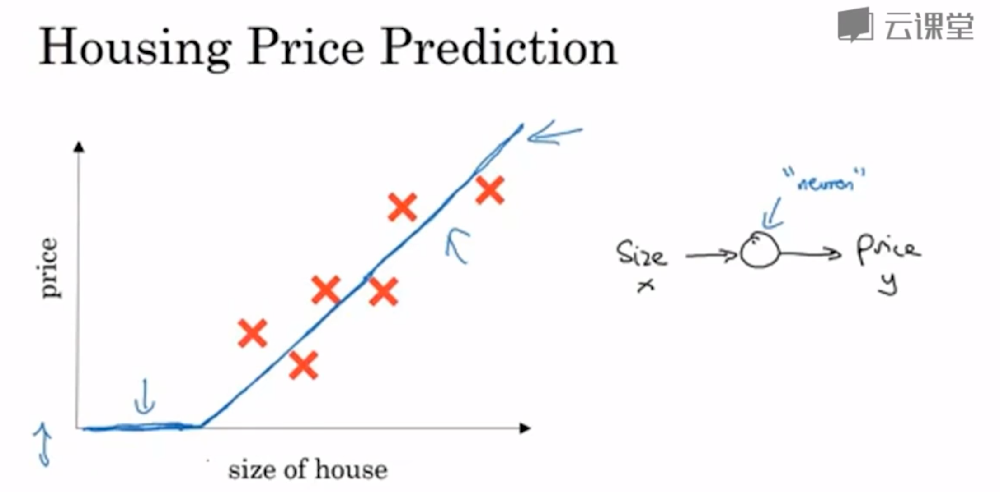
   * 神经元实现了输入房子尺寸，输出预计价格
   * `ReLU函数`(修正线性单元)；一开始是0，后面是一条直线
     * 修正指的是取不小于0的值
   * 这是一个单神经元网络，规模很小
   * 大的神经元网络是把所有的神经元堆叠起来形成的
     * 在这个基础上我们构建如下神经网络
     * 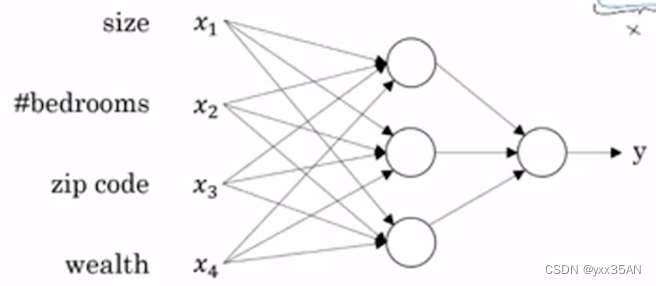
     * **中间**每个神经元都叫做**隐藏单元**，每个的输入同时来自四个特征
     * 神经网络自己决定中间每个神经元是什么，随便它怎么算
     * 要给他足够的数据(x,y训练样本)，神经网络擅长于计算从x到y的精确映射函数
     * 在神经网络中，我们只需要**输入特征**，中间每个隐藏节点的具体表示由神经网络自己获取，**最后得到最终值**

#### 三.什么是神经网络
1. 到目前为止，几乎所有由神经网络创造的经济价值，都基于其中一种机器学习-"**监督学习**"
2. **相关神经网络：**
   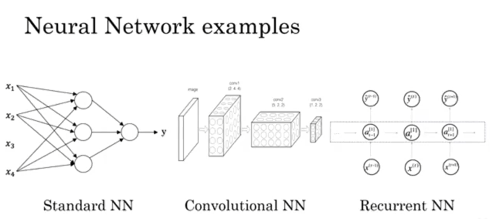
3. 机器学习被应用于**结构化数据**与**非结构化数据**
   * **结构化数据**：明确的x与明确的y-数据库
   * 
   * **非结构化数据**：图像像素，音频，文本单词
     * 计算机理解起来更难
     * 人们擅长理解这种
     * 深度学习机器学习让计算机更容易理解

#### 四.为什么深度学习会兴起？
1. 模型决定你的上限，数据能让你的模型达到这个上限
2. 小写`m`表示训练集的规模
3. `SVM`-支持向量机
4. 从sigmoid函数转换到ReLu,便能够使梯度下降法运行得更快
5. 我们现在可以获得更多的数据，现在我们有了更好更快的计算能力，使得DL快速发展

## Chatpter 1
#### 一.二分分类
1. m个样本的数据集，可能我们要用for
2. 神经网络的计算过程中，通常分为正向的过程(正向传播步骤)/反向的过程(反向传播步骤)
3. 用logistic回归来阐述-用于二分分类的算法
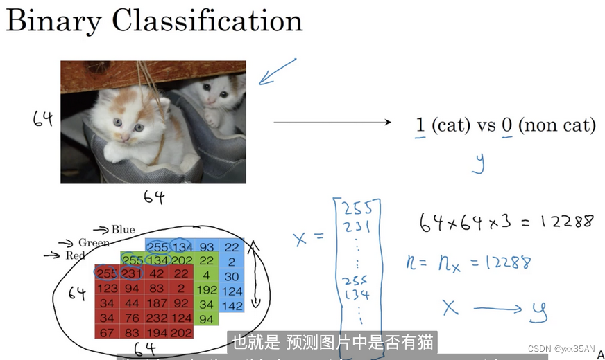
4. 如上图所示，假如你有一张图片作为输入，比如这只猫，如果识别这张图片为猫，则输出标签1作为结果；如果识别出不是猫，那么输出标签0作为结果。我们用字母 y 来表示输出的结果标签。
5. 在计算机中为了保存一张图片，需要保存三个矩阵，它们分别对应图片中的红、绿、蓝三种颜色通道，如果你的图片大小为64x64像素，那么你就有三个规模为64x64的矩阵，分别对应图片中红、绿、蓝三种像素的强度值。简单表示如下图所示（注意它们的规模为5x4而不是64x64）
6. 我们用一个特征向量来表示这张图片，把所有的像素都取出来，例如255、231等等，直到取完所有的红色像素，接着最后是255、134、…、255、134等图片中所有的红、绿、蓝像素值。如果图片的大小为64x64像素，那么向量的总维度，将是64乘以64乘以3=12288，这是三个像素矩阵中像素的总量。我们用来表示输入特征向量的维度。所以在二分类问题中，我们的目标就是习得一个分类器，它以图片的特征向量  作为输入，然后预测输出结果为1还是0，也就是预测图片中是否有猫：
7. 后面课程中需要用到的一些符号:
   * (x,y) 表示一个数据，可能是训练数据，也可能是测试数据，此处默认为训练数据；
   * x∈R^nx ; y∈{0,1}
   *  m Training Exampleing{x^(1)^,x^(2)^,x^(3)^,x^(4)^..,x^(m)^}
   *  M~train~ or M~test~
   *  如下是一个X数据矩阵
      *  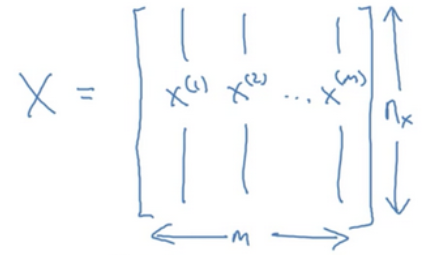
      *  X∈R^(nx)*m^ (nx行m列)
      *  Python：X.shape(nx,m)
   *  如下是一个Y数据矩阵
      *  Y=[y^(1)^,y^(2)^,y^(3)^,y^(4)^..,y^(m)^]
      *  Y∈R^1*m^(1行m列)
      *  Python：Y.shape(1,m)

#### 二.logistic回归
1. 这是一个学习算法，用在**监督学习**问题中，**输出y标签是0或1时**，是一个**二元分类**的问题
2. 对于二元分类问题来讲，给定一个输入特征向量x ，它可能对应一张图片，你想识别这张图片识别看它是否是一只猫或者不是一只猫的图片，想要一个算法能够输出预测，你称之为$$\overline{y}$$，也就是对实际值y的估计。更正式地来说，你想让$$\overline{y}$$表示y等于1的一种可能性或者是机会.
3. 我们用w来表示逻辑回归的参数，这也是一个nx维向量(因为w实际上是特征权重，维度与特征向量相同)，参数里面还有b，这是一个实数（表示偏差）。所以给出输入以及参数之后，我们怎样产生输出预测值​，**一件你可以尝试却不可行的事**是让:
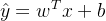 
4. 西格玛函数：
   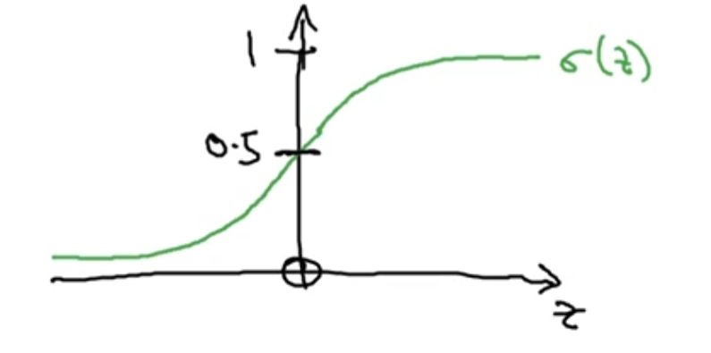
5. sigmoid函数的图像，它平滑地从0走向1，曲线与纵轴相交的截距是0.5。我们通常都使用 z来表示上述的值
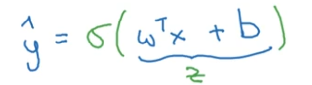
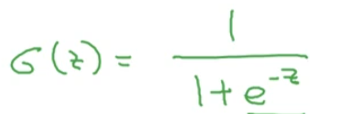
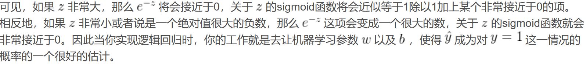
6. 注意符号规定：
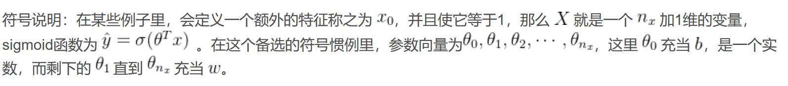
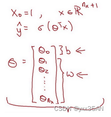
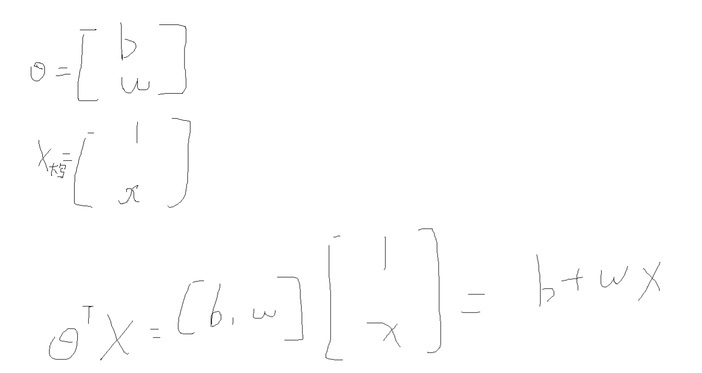

#### 三.logistic回归损失函数
1. 为了**训练**logistic回归模型的参数**w和b**，需要定义一个**成本函数**
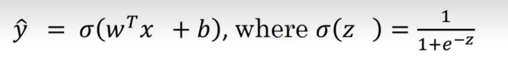
2. 