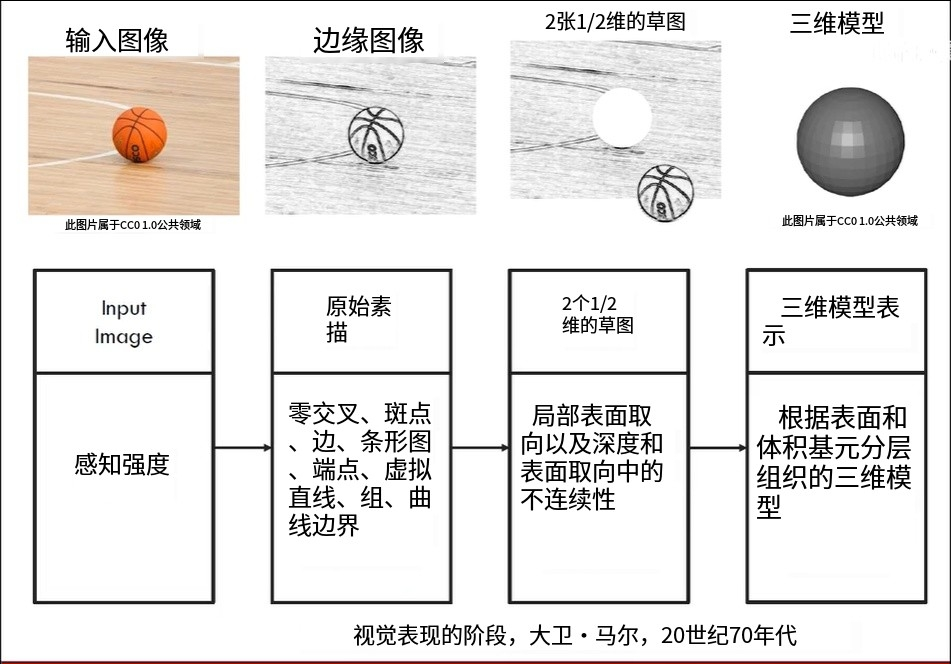

1. 计算机视觉数据像暗物质一样，我们无法直接观察到它，而且数据庞大
2. 和很多领域联系，像数学、计算机科学、心理学、生物学、物理学、工程学
   - 
3. 我们这门课更偏深度学习和卷积神经网络
4. 以往动物是不存在的，只有浮游生物，生产者和分解者没有消费者，但是寒武纪时候消费者开始爆发。
   - 寒武纪时候眼睛的器官出现了
   - 一般是嘴张着，有食物飘来就吃
5. 人类历史也悠久，墨子用到小孔成像。
   - 达芬奇，针孔，图像投到墙上
   - 但是只是传到幕布上，并没有对图像进行处理
6. 1959五十年代，重要的仿生学发现是：电极插到猫的视觉皮层里。
   - 为了处理视觉大脑一半的神经元都要进行处理
   - 猫会对切换的瞬间产生激活，对图像不感兴趣，对边缘信息(切换，对角线等)感兴趣
   - 不同神经元对不同形状产生不同的反应
7. 1963年边缘检测，把照片的边缘勾勒出来。(现在和课程作业一样)
8. 1966年，MIT人工智能课题组发了一个公告：视觉项目，认为计算视觉的基础问题可以拆成子问题，并且子问题可以都解决再一个夏天，实现真正的关键点检测和模式识别。
   - 
   - 这个事件开始计算机视觉的学科产生了
9. 写了本书叫VISION，产生了对猫实验的启发。
10. 他认为视觉是分层的
    - 边缘的检测，轮廓勾勒出来
    - 放到2.5维的空间里(老师知道你的另一半身被桌子挡了)
    - 三维模型的构建
    - 
11. 后来又提到两个模型：
    - 圆柱体模型：一切物体都是...
    - 弹簧模型：一切物体都是...
12. 1987对剃须刀进行边缘检测
13. 1997伯克利同学又想能不能抠图识别，产生叫做图像的分割分支。
    - 图像的每个像素点都找到属于它的一个类点。
14. 2001年构造人脸分类器，找到人脸的位置，用Opencv的级联分类器haar
    - 这也是李飞飞的导师让他读的第一篇论文
15. 图像特征工程思路的技巧
16. 空间金字塔的特征
17. 角度这样的特征，不同方向的梯度值，一张图变成一个向量，分类等(向量机)就可以知道他是是什么物体
18. PASCALVOC是一个20物体分类的数据集
    - 后来就不举办竞赛了
    - 李飞飞自己来办竞赛ImagNet
19. 22K个类别，15M个图片
20. 这是计算机视觉领域的竞赛，结果包含钢鼓就正确
21. 错误率降低一直，2012年发现卷积和深度学习的强大功效，然后后面的冠军模型都是深度学习架构。
    - 残差网络都获得了冠军，再Kaggle竞赛也是。
    - 从这个开始图像分类比人类强
    - 2015年的冠军是高考状元
    - 2017年就不举办图像分类的竞赛了，这个问题杀青了。
    - ICCV/CVPR都会有很多的新模型产生，比如用机器学习方法搭建神经网络。
22. 重点关注图像分类问题
23. 还会讲物体检测和图像标注的问题
24. 特别是用卷积神经网络
25. 再CNN理我们讲经典的架构
26. 从上世纪的98年开始就手写数字的识别
    - 2012年把模型进行了微小的修改，容量变得更大了。10分类到1000分类，开始使用GPU
    - 算法算力数据，是深度学习的三个燃料
27. 都满足才会有深度学习的大爆发
28. 1美元可以买多少算力，蓝色CPU红色GPU，爆发的态势
29. 谷歌提出TPU，大大提升运算的效果
30. 现在计算机视觉还有很多问题，人体姿态估计，三维重建(侧边图片还原整体)，语义分割
31. 李飞飞的课题组做的内容，物体之间各种各样的关系 语义关系理清楚。动作穿的衣服各种各样物品
32. 图像描述人眼是500ms就知道干啥的，计算机有待提升
33. 计算机不知道人际关系情商这样的方面，也是另外一个挑战
34. 而且计算机视觉能够大大提升我们的生活以及商业价值。
35. 李飞飞大牛
36. 他的视频网站啥都有
37. 进一步学习可以看这本书
38. 宗旨：透彻的从头来建立神经网络
    - 配置GPU进行训练
    - 每年都在更新课程
39. 有趣的案例，风格迁移，像什么
40. 需要具备基本编程知识
    - 这个完了后讲CS229
41. 考试不用管，下节课就会讲解最初级的图像分类的知识，线性分类器(线性的边界对他进行分类，)和K定理(看他最近的人是不是好人)。