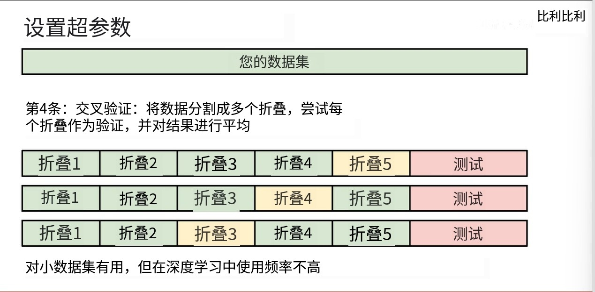

1. 讲两个重要的图像分类的算法
   - **K最近邻KNN算法**
   - **线性分类器**(神经网络中可以看到，神经网络要都先经过线性变换)
   - 算法低级实际工程中并不会使用
2. 图像分类的的流程：切分训练集验证集对模型进行评估和优化
3. 要做第一个作业(Assignment1)
   - 要用numpy实现K最近邻分类器(python里面的matlab)
   - 线性分离器(SVM,Softmax)
   - 两层神经网络
   - 图像特征
4. 我们是用不到云服务器
5. 图像分类是计算机视觉的基本问题核心问题之一，其他问题目标定位物体检测语义分割全景分割的核心还是图像分类
   - 图像分类就是给图像的东西打标签
6. 计算机看到的只是像素矩阵，RGB三通道(每个通道二维，每个数字是0-255八个比特来存储一个像素值)的图像
   - 这个是由于采集信息摄像头的一个视觉单元是8位决定的
7. 品种身姿光线半露均会改变矩阵，但都会被神经网络很好解决
8. 一般是输入图像，输出分类标签，中间就是一个黑箱，图像分类没有办法显示构建这个算法。
   - 所以不能人工去构建算法和特征
   - 用数据驱动的方法：很多张猫的图片给他自己去学习特征
9.  机器学习算法之前很多人都尝试提取特征
    - 胡博和为搜发现猫对边缘特征感兴趣
    - 先对猫进行边缘提取
    - 由边缘特征来构造更高级的特征
    - 看看他有没有耳朵，胡子等五官，这就是显式手工编写一个算法
    - 这是鲁棒性很低的，其他分类的话就要重新开始编写
    - 所以我们的办法就是用大量数据喂它
10. 机器学习的数据驱动方法
    - 收集图片和标签的数据(训练集)
    - 使用机器学习训练分类器
    - 拿分类器预测新图片(测试集)
11. K最近邻算法
    - 看它周围的特性
    - 训练过程中记忆所有的数据和标签
    - 预测最相近的数据耳朵标签
    - 惰性算法
    - 还是比随机猜比较好
12. CIFAR10数据集
    - 10 classes
    - 50000 training images
    - 10000 testing images
    - 32x32的图片
13. 怎样衡量最相近的：
    - L1距离(曼哈顿距离):对应位置的像素差求出来取绝对值，再把每个像素差+起来
    - 所有训练集50000张图片和测试图片测出L1距离，找出其最小的图片
14. 代码思路：
    - 先把训练集和训练集的标签存储下来
    - 训练O(1),预测O(N)
    - 惰性算法，不需要训练
    - 
    - 我们想要的是训练的时候可以慢一点，但是你预测必须要快
15. K最近邻算法(K=1)：
    - 决策边界是垂直平分线
    - 不要从最近的邻居那里复制标签，而是从最近的K点进行多数投票
    - K是我们需要人工指定的超参数
16. L1距离线上的点到原点的曼哈顿距离是一样的，对坐标轴旋转敏感
17. L2距离是圆上的点到原点的欧几里得距离相等，对坐标轴旋转不敏感
18. 超参数：K，L1/L2
    - 整个数据集当成训练集
    - 一部分训练一部分测试(没有反馈，只有等测试)
    - 所以加入一个验证集很合理(模拟)
    - 测试集是万万不能碰的
    - 
    - 来此得到最优超参数来得到结果
19. K临近算法的总结：
    - 先准备很多的数据和标签
    - 选择L1/L2来进行距离估计
    - 选择K的数值进行定夺，可以根据距离的远近给适当的权重
    - K和L1/L2是超参数，可以划分验证集来找最优解
    - 最终只能在测试集上检验算法！
20. 推荐系统用的就是协同过滤模型，也就是最近邻算法
21. 线性分类器：
    - 二维直角坐标中就是一条竖向量
    - 32x32x3展宽成3072个数字
    - 每个数字乘一个权重
    - 
    - 从里面找一个最大的分数，作为我们的结果
22. 有时候不能用线性分类器解决问题
    - 无法对非线性数据进行分类
23. 代数矩阵解释：矩阵相乘后相加
24. 可视化解释：把权重矩阵可视化为图像
25. 几何解释：10个超平面在3072维把数据分开了
26. 最终看打分最高的来进行判断
27. 如何真正的把这个算法构建出来
    - 损失函数
    - 优化
    - 过渡到卷积神经网络

