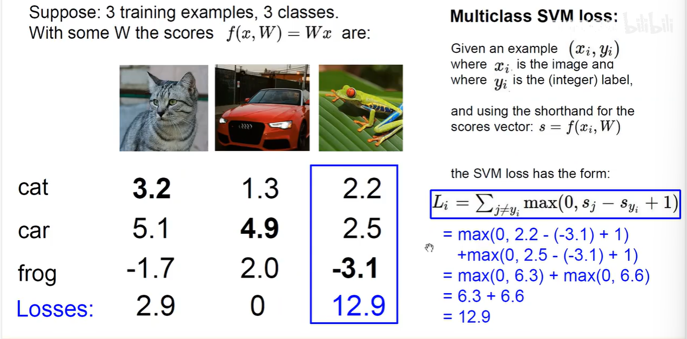
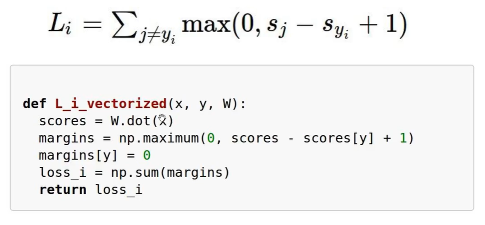
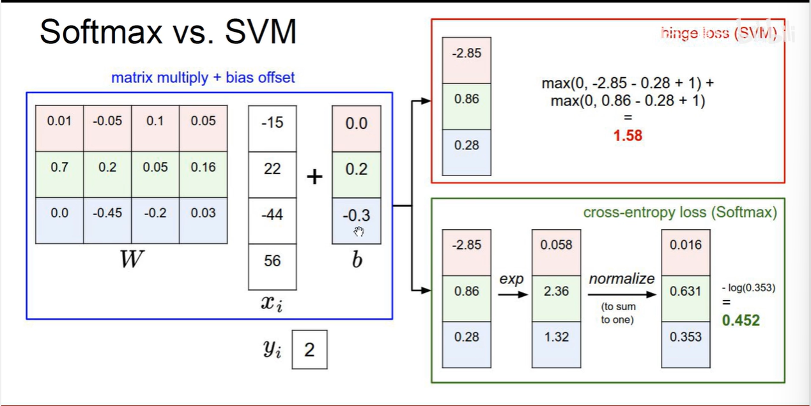
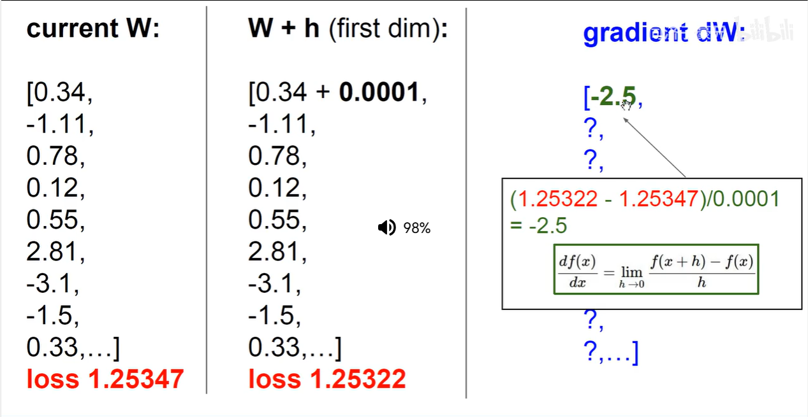

1. 今天主要讲如何定量构造损失函数/优化策略，进而求出每个权重的调节方向，为卷积神经网络奠定基础
2. 学习playground-tensorflow的网站
3. 数据分布有同心圆、异或、线性类
4. 线性分类器可以对线性类得到很好的分类，但是对异或、同心圆也无法分类
5. 铰链损失函数hinge loss:
   - 
   - 错误-正确+1与0取最大作为损失值
   - 惩罚跟正确值差1以上的分数类别，惩罚差值小于0的
   - 最后算平均值就是数据集的损失函数
   - 1是有讲究的，可以看官网笔记
   - Python的代码如下：
   - 
6. 当L=0时，W可以为很多套权重
   - 越简单越好，选数小的
   - 引入正则化
7. 强度用λ控制，让参数更加简单不要那么大
   - L2正则化：每个权重平方求和
   - L1正则化：每个权重绝对值求和
   - 弹性网络；β来进行L1、L2的权重
8. 正则化的原因：
   - 防止过拟合，防止在训练集做的太好了！
   - 让其在测试集做的更好
   - 我们需要一个大而化之的泛化，不想要做的太好
9.  防止过拟合的其他方法：
   - DropOut(掐死其他神经元)
   - Batch normalization
   - Stochastic depth, fractional pooling, etc
10. Softmax Classifier(多分类的逻辑sigmod回归)
    - 想要将分数值变为概率
    - 把分数变为e的指数，然后归一化
    - 就得到了一个图片不同标签的概率
    - 交叉熵损失函数/最大似然估计/负对数损失函数：
    - L=-log(正确类别的概率)
    - 一开始初始化s差不多一样，L就为logC，CIFER10的数据集就是log10≈2.3
    - 全部图片分类正确的联合概率就是所有正确的概率乘起来，小的话取负对数
11. KL散度可以不用管
12. 总结两个损失函数：
    - 
13. 下面进行优化过程(定义法)：
    - 求梯度可以W加一点点然后损失函数求导
    - 
    - 慢且近似值，要用求导(解析解)！
14. 优化用求导(解析解)，检查用定义(数值解)
15. 梯度下降指的是损失函数的下降而不是梯度的下降
    - 最普通的是SGD下降，会困在鞍点里
    - 大胖子是Momentum下降优化器法
16. 一小口一小口喂数据来更新w，会很快
    - 不然1000w的数据的损失函数计算会很慢
    - 哪怕过程震荡，但是单位时间走的步数多minibatch
17. 有时候要手动构造特征，送到模型里，就可以得到很好结果(用线性分类器分开)
    - 分图片为小网格HoG 方向梯度直方图
    - 把不同特征拼到一起来输入到分类模型里，叫做特征工程