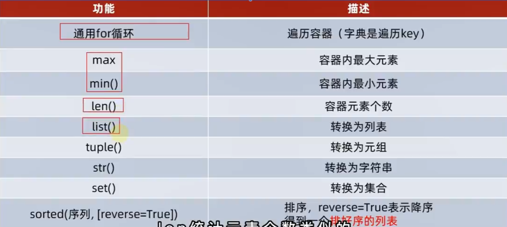

#这是Python学习的笔记

Zzzzzp 2023/9/6
## 第一章：你好Python
### 🤤 一.定义语法
1. python语言只认识**英文符号**
2. print是打印的意思，括号内字符串要加**双引号**
    ``````python
    print("Hello World")
    print("你好 世界")
    ``````

### 🤤 二.理解并认识Python解释器
安装Python环境，相当于再电脑中安装Python解释器，也就是把Python代码**解释**成0101的二进制代码**供计算机运行**。
    ==python.exe就是解释器==

所以它的**作用**如下:
   * 翻译代码
   * 提交给计算机运行

如果在**cmd运行**的话，则`python D:\python.py`来运行整体代码
``````
总结：
1. 计算机只认识0和1
2. 解释器的作用是翻译并给计算机运行
3. .py文件是python文件
4. Python解释器在python.exe中
``````
### 🤤 三.Pycharm的基本使用
1. 主题
2. 字体大小
3. 鼠标改变字体大小
4. 中文

## 第二章：Python基础语法
### 🤤 一.字面量

1. **定义:**  在代码中，被写下来的**固定的值**被称之为字面量。
2. Python中有**6**种值(数据)的类型：
   * **数字:** 整型(int;1,-1) / 浮点型(float;1.11,-1.11) / 复数(complex;1+2j,==<u>注意以j结尾</u>==) / 布尔(Bool,Ture1/False0)
   * **字符串:** 字符串(string)由任意数量的字符组成，包括中文/英文/各类符号/数字组成，所以叫做字符的串
`注意在Python中字符串需要带单引号或双引号！！！`
   * **列表：** 使用最频繁的数据类型，可有序记录一堆数据
   * **元组：** 可有序记录一堆<u>不变</u>的Python数据集合
   * **集合：** 可有序记录一堆<u>不重复</u>的Python数据集合
   * **字典：** 可无序记录一堆<u>Key-Value型</u>的Python数据集合
3. **print(字面量)**，实例：
``````python
print(123)
print(123.123)
print("好好好")
``````

### 🤤 二.注释
1. **定义:** 在程序代码中对程序代码进行解释说明的文字。
2. **实例:** 
    ``````python
    # 我是单行注释
    print("Hello World")
    """
        我是多行注释
        诗名：悯农
        作者：李绅 
    """
    ``````
3. **总结：**
   * **单行注释：** # ,即==一个井号==..
   * **多行注释：** """xxxxxx""" ,即==三对双引号==..

### 🤤 三.变量
1. **定义：** 在程序运行过程中，能**储存**计算结果或能表示值的抽象概念。简单地说，变量就是在程序运行时，记录数据用的
    `变量名称 = 变量的值`
    ``````python
    money = 50
    print("钱包还剩余:",money)
    ``````
2. print()输出多个内容时，用`,`隔开
    ``````python
    print(内容1，内容2...内容N)
    ``````
3. python允许多个变量赋值：
    ```python
    a, b, c = 1, 'a', True
    d = e = f = 1
    ```
### 🤤 四.数据类型
==变量无类型，数据有类型==
1. 我们可以通过type()语句得到数据的类型
    `type(被查看的数据)`
    ``````python
    print(type("123"))
    print(type(123))
    print(type(123.1))
    <<<
    <class 'str'>
    <class 'int'>
    <class 'float'>
    ``````

### 🤤 五.数据类型转换
1. 为什么需要学习变量转换？ 
* 从文件中读取的数字默认是字符串，我们需要转换成数字类型
* 后续学习的input()语句，默认结果是字符串，若需要数字也需要转换

  ``````
  int(x)    将x转换为整数
  float(x)  将x转换为浮点数
  str(x)    将x转换为字符串
  ``````
  ==带有返回值的，可以直接输出。==
  ``````python
  num_str=str(11)
  print(type(num_str),num_str)

  float_str=str(11.123)
  print(type(float_str),float_str)
  ``````

2. 注意
   * 任何类型都可以转换为字符串
   * 字符串不能任意转换为数字
   * 浮点数转整数会丢失精度,直接去尾
   * `int("88.88")``int("你好")`都不行

### 🤤 六.标识符
1. **定义：** 变量的名字，类的名字等，这些**名字**统一称都是标识符
2. **命名规则：** 字母/数字/下划线，==不能以数字开头==
3. Python中有一系列单词，称之为**关键字**，它们都有**特殊用途**，我们不可以用它们作为标识符
4. **命名规范：**
   * 全小写，别的语言是驼峰
   * 英文单词间用_
   * 让人理解的变量名
  
### 🤤 七.运算符
1. 加+ 减- 乘* 除/ 取整// 取余% 指数**
2. 加等+= 减等-= 乘等*= 除等/= 取整等//= 取余等%= 指数等**= 
3. ==取整若有小数结果会是一个float类型==
4. 实例：
    ```python
    print(0.55 + 0.41)
    print(0.55 + 0.4)
    print(0.55 + 0.411)
    <
    0.96
    0.9500000000000001
    0.9610000000000001
    ```
原因：计算机对浮点数的表达本身是不精确的。保存在计算机中的是二进制数，二进制对有些数字不能准确表达，只能非常接近这个数。
### 🤤 八.字符串的三种定义方式
**1. 字符串的定义方式：**
   * 单引号定义法：name = 'zp'
   * 双引号定义法：name = "zp"
   * 三引号定义法：name = """zp"""
   * 三引号也可以这样：
    ```
    str1 = '''a
    b
    c
    '''
    print(str1)
    ###输出
    a
    b
    c


    # 注意这里是两个换行
    ```
 
  > 三引号定义法，和多行注释一样，同样支持换行操作
  > 使用变量接收它，它就是字符串
  > 不接收，就是注释
  > 空字符串是为 False 的

**2. 字符串包含单引号/双引号，如何写？**
   * 单引号定义法，可以内含双引号
   * 双引号定义法，可以内含单引号
   * 使用转义字符`\`

### 🤤 九.字符串的拼接
1. 两个字符串可以用`+`来拼接
    ``````python
    print("123"+"456")
    ``````
2. 但是无法和非字符串类型进行拼接
3. 即`+`只能完成==字符串之间==的拼接
4. 大多数也会`变量`和`字面量`进行拼接

### 🤤 十.字符串格式化
**1. 字符串和字符串的快速拼接：**
    ``````python
    name = "zp"
    message = "我的名字是%s" %name
    print(message)
    ``````
其中，`%`表示我要占位，`s`表示将变量变成字符串放入占位的地方
**2. 字符串和多个数字变量的快速拼接：**
    ``````python
    zhou_age = 22
    gap = 1
    message = "我的年龄是%s+%s岁" %(zhou_age,gap)
    print(message)
    ``````
==多个变量占位，需要按占位顺序括住==
**3. 字符串/整数/浮点数三占位：**
    ``````python
    name = 'zp'
    zhou_age = 22
    gap = 1.0
    message = "我的名字是%s,我的年龄是%d+%f岁" %(name,zhou_age,gap)
    print(message)
    输出
    我的名字是zp,我的年龄是22+1.000000岁
    ``````

### 🤤 十一.格式化的精度控制
1. 可以使用辅助符号`"m,n"`来控制数据的宽度和精度
   * m是宽度，设置的宽度小于数字自身m不生效 **(很少使用)**
   * n是精度，会进行小数的**四舍五入**
2. 实例
   `%5d`:将整数的宽度限制在5位。如数字11即为[ ][ ][ ]11
   `%7.2f`:11.345即为[ ][ ]11.35
   `%.2f`:11.355即为11.36

### 🤤 十二.字符串的格式化方式二
1. 实例
    ``````python
    name = 'zp'
    zhou_age = 22
    gap = 1.0
    message = f"我的名字是{name},我的周岁年龄是{zhou_age},我的间隔是{gap}"
    print(message)
    ``````
2. 要点
   * 不理会类型
   * 不做精度改变
   * f"{变量}{变量}"
   * f是关键！！！

### 🤤 十三.对表达式进行格式化
1. **表达式是什么？**
   表达式是一条具有明确执行结果的代码语句
   `1+1,5*2,name='zp',就是表达式`
2. **直接对表达式进行格式化**
    ``````python
    print("1+1的结果是%d"%(1+1))
    print(f"1+1的结果是{1+1}")
    print("字符串在Python中的类型是%s"%(type("abc")))
    ``````
即在无须进行变量存储的时候，直接对表达式进行格式化
3. **练习题：**
   
    ``````python
    name = "传智播客"
    stock_price = 19.99
    stock_code = "003032"
    stock_price_daily_growth_factor = 1.2
    growth_days = 7
    print(f"公司是{name},股票代码：{stock_code}，当前股价{stock_price},每日增长系数是{stock_price_daily_growth_factor},经过{growth_days}天增长后，股价达到了{stock_price*stock_price_daily_growth_factor**growth_days:.2f}")
    """
    注意那个:.2f，也就是说，在f的格式化中也可以控制精度
    """
    ``````

### 🤤 十四.数据输入:input()语句
1. **输出与输入**
   * printf():数据输出
   * input():数据输入
2. **input()使用方法**
   使用一个变量接收即可
3. **实例**
    ``````python
    print("请告诉我你是谁？")
    name = input()
    print(f"Get!!!You are {name}!!!")
    ``````
input()可以在==输入前先输出==，比如
    ``````python
    name = input("请告诉我你是谁？")
    print(f"Get!!!You are {name}!!!")
    ``````
4. **input()统统把==输入当作字符串==看待**
5. **数据类型转换**

    ``````python
    num = input("请告诉我你的银行卡密码：")
    num = int(num)
    print(f"你的银行卡密码是{num}")
    print(f"你的银行卡密码类型是{type(num)}")
    ``````

6.**拓展**
    ``````python
    print("您好：", input("用户名"), ",您是尊贵的：", input("类型"), "用户，欢迎您的光临。")
    print(f"您好:{input('用户名')},您是尊贵的:{input('类型')}用户,欢迎您的光临.")
    ``````
当printf()与input()均有时，先执行input()，第一种<u>输出**前后**都会有**空格**</u>；第二种<u>没有</u>

## 第三章：Python判断语句
### 🤤 一.布尔类型和比较运算符
1.  **布尔类型**：
   布尔类型的数据，不仅可以通过<u>**定义**</u>到，也可以通过<u>**比较运算符**</u>进行内容比较得到
   `True and False`
    ``````python
    result = 10 > 5
    print(f"10>5的结果是{result},类型是{type(result)}")
    >
    10>5的结果是True,类型是<class 'bool'>
    ``````


### 🤤 二.if语句的基本格式
1. **实例：**
``````python
age = 24
if age > 18:
    print("已经成年了！！！")
``````
2. **注意：**
   * if判断正确后**执行的是顶格(4个空格)的内容**
   * Python通过**缩进**判断**代码的归属关系**

3. **习题：**
``````python
print("欢迎来到游乐园，成人收费，儿童免费")
age = int(input("请输入你的年龄"))
if age>=18:
    print("你已成年，游玩需要补票10元")
print("祝您游玩愉快")
``````

### 🤤 三.if-else语句
1.**实例：**
    ``````python
    print("欢迎来到游乐园，成人收费，儿童免费")
    age = int(input("请输入你的年龄"))
    if age>=18:
        print("你已成年，游玩需要补票10元")
    else:
        print("你未成年，可以免费游玩")
    print("祝您游玩愉快")
    ``````
2. **注意：**
   * `else`后**不需要判断条件**
   * `else的代码块`需要**四个空格缩进**


### 🤤 四.if-elif-else语句
==用于判断**条件有多个**的情况==
1. **实例：**
    ``````python
    print("欢迎来到游乐园")
    height = int(input("请输入你的身高："))
    vip_level=int(input("请输入你的VIP等级："))
    if height < 120:
        print("你的身高未超过120cm，可以免费游玩")
    elif vip_level>3:
        print("你的VIP等级大于3，可以免费游玩")
    else:
        print("抱歉，所有条件都不满足，加10元票费")
    print("祝您游玩愉快")
    ``````

2. **优化：**
==将input**输入语句直接写入判断条件**中，节省代码量==
    ``````python
    print("欢迎来到游乐园")
    if int(input("请输入你的身高：")) < 120:
        print("你的身高未超过120cm，可以免费游玩")
    elif int(input("请输入你的VIP等级：")) > 3:
        print("你的VIP等级大于3，可以免费游玩")
    else:
        print("抱歉，所有条件都不满足，加10元票费")
    print("祝您游玩愉快")
    ``````

3. **注意：**
   * 条件是**互斥且有顺序**的，一个满足下面都不会再执行了
   * 同样注意**四个空格缩进**！
   * 整个代码块中有input()先执行完所有的input()

4. **习题：猜数字**
    ``````python
    if int(input("请输入第一次想的数字：")) == num:
        print("恭喜你猜对了")
    elif int(input("猜错了，再猜一次：")) == num:
        print("恭喜你猜对了")
    elif int(input("猜错了，最后再猜一次：")) == num:
        print("恭喜你猜对了")
    else:
        print(f"Sorry,全猜错啦，我想的是{num}")
    ``````

### 🤤 五.判断语句的嵌套
==存在**需要满足前置条件才会触发二次条件**的情况== 
1. **方法：**
   自由组合if-elif-else完成特定的需求
2. **实例：**
``````python
print("欢迎来到动物园")
if int(input("输入你的身高")) > 120:
    print("你的身高不符号要求，不可以免费")
    print("不过你的vip等级大于3，可以免费哦")
    if int(input("请输入你的vip等级(0~5)")) > 3:
        print("尊贵的vip，里面请！")
    else:
        print("不好意思你的条件都不满足，请买票")
else:
    print("欢迎来玩，小朋友")
``````
3. 习题:
```
必须是大于等于18岁小于30岁的成年人
同时入职时间需要大于两年，或者级别大于3才可领取
```
``````python
age = int(input("请输入你的年龄："))
year = int(input("请输入你的入职年龄："))
vip =  int(input("请输入你的vip等级："))
if age >= 18:
    print("你是成年人")
    if age < 30:
        print("你的年龄达标了")
        if year > 2:
            print("你的入职时间/年龄均达标了，可以领取")
        elif vip > 3:
            print("你的vip等级/年龄均达标了，可以领取")
        else:
            print("不好意思，尽管年龄达标，但是你的入职时间/vip等级不够！")
    else:
        print("不好意思你年龄太大了")
else:
    print("不好意思，你年龄太小了")
``````

### 🤤 六.实战案例
```
1. 定义一个随机数(1~10,随机产生)，通过3次判断猜出来数字
2. 有三次猜中机会，通过3层嵌套判断实现
3. 每次猜不中，会提示猜大了或猜小了
```
``````python
import random
real_num = random.randint(1, 10)
guess_num = int(input("请输入你第一次要猜测的数字"))
if guess_num == real_num:
    print("恭喜你，第一次猜测猜对了")
else:
    if guess_num > real_num:
        print("猜大了，请猜第二次")
    else:
        print("猜小了，请猜第二次")
    guess_num = int(input("请输入第二次要猜测的数字："))
    if guess_num == real_num:
        print("恭喜你，第二次猜测猜对了")
    else:
        if guess_num > real_num:
            print("猜大了，请猜第三次")
        else:
            print("猜小了，请猜第三次")
        guess_num = int(input("请输入第三次要猜测的数字："))
        if guess_num == real_num:
            print("恭喜你，第三次猜测猜对了")
        else:
            if guess_num > real_num:
                print("猜大了，三次机会都没了")
            else:
                print("猜小了，三次机会都没了")
``````

## 第四章：Python循环语句
### 🤤 一.while循环的基础应用
1. **实例：**
``````python
i = 0
while i <= 100:
    print(i)
    i += 1
<
打印0到100
``````
2. **注意：**
   * 缩进四个空格
3. **习题：**
``````
计算从1+2+3..+100
``````
``````python
i = 0
sum=0
while i <= 100:
    sum+=i
    i += 1
print(sum)
``````

### 🤤 二.while循环的基础案例
```
1. 定义一个随机数(1~100,随机产生)，无数次判断猜出来数字
2. 无数次猜中机会
3. 每次猜不中，会提示猜大了或猜小了
4. 猜完数字后，提示猜了几次
```
``````python
import random

real_num = random.randint(1, 100)
i = 1
guess_num = int(input(f"请哥哥第{i}次猜测数字："))
while guess_num != real_num:
    if guess_num > real_num:
        print("猜大了哥哥")
    else:
        print("猜小了哥哥")
    guess_num = int(input(f"请哥哥第{i+1}次猜测数字："))
print(f"哥哥猜对了，我想的是{real_num},而你猜的是{guess_num}")
``````
或者定义一个flag，本来是True,再在while中一直input，猜对就为False

### 🤤 三.while循环的嵌套应用
1. **实例：**
``````python
while i <= 100:
    print(f"今天是第{i}天，准备表白...")
    
    j = 1
    while j <= 10:
        print(f"送给pjw第{j}只玫瑰")
        j += 1
        
    print("pjw我喜欢你")
    i+=1

print(f"坚持到第{i-1}天，表白成功")
``````
2. **注意：**
   * 注意空格缩进
   * 不要无限循环

### 🤤 四.while循环的嵌套案例
```
打印99乘法表
```
1. 小技巧：
   * 打印代码后加`,end=''`即可实现不换行，无缝衔接
   * 可以使用`\t`进行字符串对齐
``````python
i = 1
while i < 10:  # row
    j = 1  # 这里必须从1开始所以j定义在里面，定义while定义while
    while j <= i:  # Column
        print(f"{j}x{i}={j * i}\t", end='')
        j += 1
    print("")
    i += 1
``````

### 🤤 五.for循环的基本用法
1. **实例：**
``````python
name = 'zpppjw'
for x in name:
    print(x)
``````
2. **案例：**
`数一数有几个'a'`
``````python
name = 'itheima is a brand of itcastaaa'
i = 0
for x in name:
    if x == 'a':
        i += 1
print(i)
``````

### 🤤 六.for-range语句
1. for循环中<u>**待处理数据集**</u>指的是<u>**序列类型**</u>
   * 字符串
   * 列表
   * 元组
   * 等
2. 语法：
   * 获取一个从**0到num(不含num)** 的序列：**range(num)**
   * 获取一个从**num1开始到num2** 的序列:**range(num1,num2)**
   * 获取一个从**num1开始到num2,步长为num3**  的序列:**range(num1,num2,num3)**
3. range的好处就是**确定for循环确定的次数**，<u>`x`**用不用都行**</u>
4. **案例**
   `有多少个偶数`
``````python
count = 0
for x in range(1, 101):
    if x % 2 == 0:
        count+=1
print(count)
``````

### 🤤 七.for-变量作用域
1. for循环的x是**临时变量**，**外界**按道理**不允许访问**
2. 但是若**外界非要访问**，是**可以**访问的
3. 如果**外界非要访问**的话，那就把这个**临时变量变成全局变量**，然后访问等级就一样了

### 🤤 八.for循环的嵌套使用
1. **实例：**
``````python
i = 1
for i in range(1, 101):
    print(f"今天是表白PJW的第{i}天")
    for j in range(1,11):
        print(f"第{i}天送了PJW第{j}支花")
    print(f"表白PJW的第{i}天结束")
print(f"终于在第{i}天成功表白了pjw")
``````
2. while和for可以相互嵌套
3. **案例一：**
    ```
    用for循环打印99乘法表
    ```
    ``````python
    for i in range(1,10):
        for j in range(1,i+1):
            print(f"{j}x{i}={j*i}\t",end='')
        print()
    ``````
比如，你试了之后，会发现整数和浮点数是不可以直接放在 for 循环里面的。
4. **案例二：**
   ```python
    for num in range(10,20):  # 迭代 10 到 20 之间的数字
    for i in range(2,num): # 根据因子迭代
        if num%i == 0:      # 确定第一个因子
            j=num/i          # 计算第二个因子
            print ('%d 是一个合数' % num)
            break            # 跳出当前循环
    else:                  # 循环的 else 部分
        print ('%d 是一个质数' % num)
    <
    10 是一个合数
    11 是一个质数
    12 是一个合数
    13 是一个质数
    14 是一个合数
    15 是一个合数
    16 是一个合数
    17 是一个质数
    18 是一个合数
    19 是一个质数
   ```
   其实 for 循环中的语句和普通的没有区别，else 中的语句会在循环正常执行完（即 for 不是通过 break 跳出而中断的）的情况下执行。
### 🤤 九.continue 和 break
1. 会有**如下情况**发生：
   * 暂时跳过某次循环，直接进行下一次
   * 提前退出循环，不再继续
2. 对上述情况：
   * **continue** 进行**临时跳过**
   * **break**   进行**直接结束**
   * 只能**作用在所在循环上**，无法对上层循环起作用
3. **continue实例：**
    ``````python
    for i in range(1,6):
        print("AAA")
        continue
        print("BBB")
    >
    打印五个AAA
    ``````
1. **continue实例：**
    ``````python
    for i in range(1,6):
        print("AAA")
        for j in range(1,6):
            print("BBB")
            continue
            print("CCC")
        print("DDD")
    >
    """
    1个AAA5个BBB1个DDD执行5次
    """
    ``````

1. **break实例**
    ``````python
    for i in range(1,6):
        print("AAA")
        break
        print("BBB")
    print("CCC")
    >
    """
    1个AAA1个CCC
    """
    ``````

1. **break实例**
    ``````python
    for i in range(1,6):
        print("AAA")
        for j in range(1,6):
            print("BBB")
            break
            print("CCC")
        print("DDD")
    >
    """
    AAABBBDDD执行五次
    """
    ``````

### 🤤 十.循环综合案例
    ```
    某公司，账户余额有1W元，给20名员工发工资
    员工编号从1到20，每人可领1000元
    领工资时，财务判断员工的绩效分（1-10），如果低于5，不发工资，下一位
    如果工资发完了结束发工资
    ```
    ``````python
    import random

    now_money = 10000
    for worker in range(1, 21):
        score = random.randint(1, 11)
        if score < 5:
            print(f"员工{worker},绩效分{score}分,低于5,不发工资，下一位")
            continue
        else:
            now_money = now_money - 1000
            print(f"向员工{worker}发放工资1000元，账户余额还剩{now_money}元")
            worker += 1
        if now_money == 0:
            break
    print("工资发完了，下个月再来领取吧")
    ``````

## 第五章：Python函数
### 🤤 一.函数初体验
1. **函数定义：**
   函数是**组织好的**，**可重复使用的**，用来实现特定功能的**代码段**
2. **案例：**
    ```
    不使用内置函数len(),完成字符串长度的计算
    ```
    ``````python
    str1 = "itheima"
    str2 = "itcast"
    str3 = "python"

    count = 0
    for i in str1:
        count+=1
    print(f"字符串{str1}的长度是{count}")

    count = 0
    for i in str2:
        count+=1
    print(f"字符串{str2}的长度是{count}")

    count = 0
    for i in str3:
        count+=1
    print(f"字符串{str3}的长度是{count}")
    ``````

3. 用**函数来优化**上面的操作：
    ``````python
    str1 = "itheima"
    str2 = "itcast"
    str3 = "python"
    def my_len(str):
        count = 0
        for i in str:
            count+=1
        print(f"字符串{str}的长度是{count}")
    my_len(str1)
    my_len(str2)
    my_len(str3)
    ``````

### 🤤 二.函数的基础定义语法
1. **函数的定义：**
    ```python
    def 函数名(传入参数):
        函数体
        return 返回值
    ```
2. **实例：**
    ```python
    def say_hi():
        print("hello")
        
    say_hi()
    ```
3. **注意事项：**
   * 参数如不需要，可以省略
   * 返回值如不需要，可以省略
   * 函数必须先定义后使用

### 🤤 三.函数的参数
1. **实例：**
    ```python
    def add(x, y):
        result = x + y
        print(f"{x}+{y}的值为{result}")

    add(5, 6)
    ```
2. **注意事项：**
   * `x,y`为形式参数
   * `5,6`为实际参数

### 🤤 四.函数的返回值
1. **实例：**
    ```python
    def add(x, y):
        result = x + y
        return result
        print("123")

    r = add(1, 2)
    print(r)
    <
    print("123")语句不会输出
    ```
2. 注意：
   * return后的代码不会执行

### 🤤 五.函数返回值之None语句
1. 如果函数**没有return**语句，那么函数**会有返回值吗？**
2. Python中有一个**特殊的字面量**，其类型是`<calss 'NoneType>`
3. 无返回值的函数，实际上返回了None这个字面量
4. **实例：**
    ```python
    def add():
        print("123")

    r = add()
    print(r)
    print(f"{type(r)}")
    <
    123
    None
    <class 'NoneType'>
    ```
5. 也可以**return None**
6. **None****的****应用**：
   * 用在**函数无返回值**上
   * 用在if判断上，**等同于False**
   * 声明暂时不用的变量上 **Name = None**
7. **实例：**
    ```python
    def check_age(age):
        if age>18:
            return "success"
        return None

    result = check_age(12)
    if not result:
        print("未成年禁入")
    ```

### 🤤 六.函数的说明文档
1. 在函数中**添加多行注释**，会直接生成**解释函数的文本**
2. 实例：
    ```python
    def check_age(age):
        """

        :param age:
        :return: 
        """
        if age>18:
            return "success"
        return None
    ```
3. 可以通过**鼠标悬停**，查看  **==自己编写的==** **调用函数的说明文档**

### 🤤 七.函数的嵌套使用
1. **定义：**
   一个函数里面又调用了另一个函数
2. **实例：**
    ```python
    def fun_b():
        print("----2----")

    def fun_a():
        print("----1----")
        fun_b()
        print("----3----")

    fun_a()
    <
    ----1----
    ----2----
    ----3----
    ```

### 🤤 八.变量的作用域
1. **局部变量：**
   定义在函数体内部的变量，即只在函数体内部生效
2. **实例：**
    ```python
    def testA():
        num=123
        print(123)
    testA()

    print(num) #报错，未定义
    ```
3. **全局变量：**
   在函数体内外都能生效的变量
4. **实例：**
    ```python
    num = 100

    def testA():
        print(num)

    def testB():
        print(num)

    testA()
    testB()
    <
    100
    100
    ```
5. **注意：**
   * 局部和全局名字一样，**局部对全局无影响**
  
6. **实例：**
    ```python
    num =100
    def testA():
        print(num)

    def testB():
        global num
        num = 200
        print(num)
        
    testA()
    testB()
    print(num)
    <
    100
    200
    200
    ```
`global`关键字，可以使 ==**函数内部声明的局部变量变为全局变量**==

### 🤤 九.函数的综合案例


```python
# 定义全局变量money,name
money = 5000000
name = None

# 要求客户输入姓名
name = input("请输入您的姓名：")


# 定义查询函数
def query(show_header):
    if show_header:
        print("------查询余额------")
    print(f"{name}您好，您的余额剩余{money}元")


# 定义存款函数
def saving(num):
    global money #money在函数内部定义为全局变量
    money += num
    print("------存款------")
    print(f"{name}您好，您存款{num}元成功")
    query(False)#查询余额

# 定义取款函数
def get_money(num):
    global money #money在函数内部定义为全局变量
    money -= num
    print("------取款------")
    print(f"{name}您好，您取款{num}元成功")
    query(False)#查询余额

#主菜单函数
def main():
    print("------主菜单------")
    print(f"{name}您好，请选择操作")
    print("查询余额\t[输入1]")
    print("存款\t[输入2]")
    print("取款\t[输入3]")
    print("退出\t[输入4]")
    return input("请输入您的选择：")

#设置无限循环，确保程序不退出
while True:
    keyboard_input=main()
    if keyboard_input == '1':
        query(True)
        continue #通过continue下一次循环，回到主菜单
    elif keyboard_input == '2':
        num = int(input("您想要存多少钱请输入"))
        saving(num)
        continue
    elif keyboard_input == '3':
        num = int(input("您想要取多少钱请输入"))
        get_money(num)
        continue
    else:
        print("程序退出啦")
        break

```

## 第六章：Python数据容器
### 🤤 一.数据容器入门
1. 如果我想要在程序中，记录5名学生的信息，如姓名。如何做呢？
2. 之前学习方法：定义五个变量分别存入
3. 但若是500名呢？
```python
name_list=['A','B','C','D','E']
<
一个变量记录了五份数据，或更多数据！
```
4. 数据容器：
   * 称为**元素**，包括各种各样的数据类型
   * 根据容器特点的不同可以分为：
     * 是否支持**重复元素**
     * 是否可以**修改**
     * 是否**有序**，等
   * 分为5类，分别是 列表(list) 元组(tuple) 字符串(str) 集合(set) 字典(dict)

### 🤤 二.列表的定义语法
1. **定义：**
    ```python
    # 基本语法

    # 字面量
    [元素1,元素2,,元素3,元素4,元素5]

    # 定义变量
    变量名称 = [元素1,元素2,,元素3,元素4...]

    # 定义空列表
    变量名称 = []
    变量名称 = list()
    ```
2. 注意：
   * 支持嵌套
   * 称为元素
   * 逗号隔开
3. **实例：**
    ```python
    my_list=['pjw',666,True]
    print(my_list)
    print(type(my_list))
    <
    ['pjw', 666, True]
    <class 'list'>
    ```
    ```python
    my_list = [[1,2,3],[4,5,6]]
    print(my_list)
    print(type(my_list))
    <
    [[1, 2, 3], [4, 5, 6]]
    <class 'list'>
    ```

### 🤤 三.列表的下标索引
1. **下标索引**---取出特定元素
2. **实例：**
👉第一个元素下标从0开始依次递增
👈最后一个元素下标-1依次递减
    ```python
    my_list = ['A','B','C']
    print(my_list[0])
    print(my_list[1])
    print(my_list[2])
    <
    A
    B
    C
    ```
    ```python
    my_list = ['A','B','C']
    print(my_list[-3])
    print(my_list[-2])
    print(my_list[-1])
    <
    A
    B
    C
    ```
3. **嵌套列表**，同样支持下标索引
```python
my_list = [[1, 2, 3], [4, 5, 6]]
print(my_list[0][1])
<
2
```

### 🤤 四.列表的常用操作方法
1. **前言：**
   如果将函数定义为`class(类)`的成员，那么函数就称为：**方法**
    ```python
    class Student:

        def add(self,x,y):
            return x+y
    ```
2. 方法和函数功能一样，有传入参数，有返回值，只是方法的使用格式不同
3. **使用方法：**
   * 函数的使用
    ```python
        add(x,y)
    ```
   * 方法的使用
     ```python
        student = Student()
        num = student.add(1,2)
    ```
4.  列表的**查询功能**：
    * `列表.index(元素)`
    * index就是列表对象(变量)**内置的方法**(函数)
    ```python
    my_list = ['a','b','c']
    print(my_list.index('a'))
    <
    0
    ```
5. 特定位置的**修改元素值**:
    ```python 
    # 正向下标
    my_list = [1,2,3]
    my_list[0] = 5
    print(my_list)

    #反向下标
    my_list = [1,2,3]
    my_list[-3] = 5
    print(my_list)
    <
    [5, 2, 3]
    [5, 2, 3]
    ```

6.**插入元素**:
    ```python 
    my_list = [1,2,3]
    my_list.insert(1,4)
    print(my_list)
    <
    [1, 4, 2, 3]
    ```

7. **追加元素**:
   * 将指定元素追加到列表的尾部
    ```python
    my_list = [1,2,3]
    my_list.append(4)
    print(my_list)
    <
    [1, 2, 3, 4]
    ```

8. **追加一批元素：**
   * 列表.extend(其它数据容器)，将其它数据容器的内容取出，依次追加到列表尾部
    ```python
    my_list = [1,2,3]
    my_list.extend([4,5,6])
    print(my_list)
    <
    [1, 2, 3, 4, 5, 6]
    ```

9. **删除元素：**
    * del 元素[下标]
    * 列表.pop(下标)
    ```python
    my_list = [1,2,3]
    my_list.pop(0)
    print(my_list)

    my_list = [1,2,3]
    del my_list[1]
    print(my_list)
    <
    [2, 3]
    [1, 3]
    ```

10. **删除****某元素在列表中的****第一个匹配项：**
    * 列表.remove(元素)
    ```python
    my_list = [1, 2, 3, 2, 3]
    my_list.remove(2)
    print(my_list)
    <
    [1, 3, 2, 3]
    ```

11. **清空列表内容：**
    ```python
    my_list = [1, 2, 3, 2, 3]
    my_list.clear()
    print(my_list)
    <
    []
    ```

12. **统计****某元素在列表内的数量：**
    * 列表.count(元素)
    ```python
    my_list = [1, 2, 3, 2, 3]
    num = my_list.count(2)
    print(num)
    <
    2
    ```

13. **统计列表中有多少元素：**
    * len(列表)
    ```python
    my_list = [1, 2, 3, 2, 3]
    num = len(my_list)
    print(num)
    <
    5
    ```

14.**总结**


1.  **列表的特点：**
    * 可以容纳多个元素(上限为2**639223372036854775807个)
    * 可以容纳不同类型的元素(混装)
    * 数据是有序存储的(有下标序号)
    * 允许重复数据存在
    * 可以修改(增加或删除元素等)

### 🤤 五.列表的遍历
1. **定义：**
   将容器内的元素**依次取出进行处理**的行为，称为**遍历/迭代**
2. **while** - 下标索引
    ```python
    def list_while_func():
        my_list = ['a', 'b', 'c']

        index = 0
        while index < len(my_list):
            element = my_list[index]
            print(f"第{index}个元素是{my_list[index]}")
            index += 1


    list_while_func()
    ```
    3. **for** - 下标索引
    ```python
    def list_for_func():
        my_list = ['a', 'b', 'c']

        for element in my_list:
            print(f"是{element}")


    list_for_func()
    ```
4. **注意**：while循环和for循环，都是循环语句，但细节不同:
   * 在循环控制上：
     * while循环可以自定循环条件，并自行控制
     * for循环不可以自定循环条件，只可以一个个从容器内取出数据
   * 在无限循环上：
     * while循环可以通过条件控制做到无限循环
     * for循环理论上不可以，因为被遍历的容器容量不是无限的
   * 在使用场景上：
     * while循环适用于任何想要循环的场景
     * for循环适用于,遍历数据容器的场景或简单的固定次数循环场景
5. **案例：**
    ```python
    def get_oven_while():
        my_list = [1, 2, 3, 4, 5, 6, 7, 8, 9, 10]
        new_list = []
        index = 0
        while index < len(my_list):
            if my_list[index] % 2 == 0:
                new_list.append(my_list[index])
            index += 1
        print(f"通过while循环，从列表中取出偶数，组成新列表{new_list}")


    def get_oven_for():
        my_list = [1, 2, 3, 4, 5, 6, 7, 8, 9, 10]
        new_list = []
        index = 0
        for element in my_list:
            if element % 2 == 0:
                new_list.append(element)
        print(f"通过for循环，从列表中取出偶数，组成新列表{new_list}")


    get_oven_while()
    get_oven_for()
    ```
6. 遍历实例：
    ```python
    # 3、for 循环也可以迭代 dict （字典）
    dict1 = {'name':'两点水','age':'23','sex':'男'}

    for key in dict1 :    # 迭代 dict 中的 key
        print ( key , end = ' ' )

    print('\n')

    for value in dict1.values() :   # 迭代 dict 中的 value
        print ( value , end = ' ' )

    print ('\n')

    # 如果 list 里面一个元素有两个变量，也是很容易迭代的
    for x , y in [ (1,'a') , (2,'b') , (3,'c') ] :
        print ( x , y )
    ```
### 🤤 六.元组的定义与操作
1. **元组特点：**
   * 可以==封装多个不同类型==的元素
   * 一旦定义完成，==不可修改==
    ```python
    # 定义元组字面量(元素，元素，元素)
    (element,element,element...,element)
    # 定义元组变量
    变量名称 = (element,element,element...,element)
    # 定义空元组
    变量名称 = ()
    变量名称 = tuple()
    ```

    ```python
    t1 = (1, 'a', True)
    t2 = ()
    t3 = tuple()
    t4 = ('a',)
    print(f"t1的类型是：{type(t1)},内容是{t1}")
    print(f"t2的类型是：{type(t2)},内容是{t2}")
    print(f"t3的类型是：{type(t3)},内容是{t3}")
    print(f"t4的类型是：{type(t4)},内容是{t4}")
    <
    t1的类型是：<class 'tuple'>,内容是(1, 'a', True)
    t2的类型是：<class 'tuple'>,内容是()
    t3的类型是：<class 'tuple'>,内容是()
    t4的类型是：<class 'tuple'>,内容是('a',)
    ```
**元组若只有一个元素则需要在元素后加一个逗号**
1. 元组也支持嵌套：
    ```python
    t5 = ((1,2,3),(4,5,6))
    num = t5[1][2]
    print(num)
    <
    6
    ```
2. 元组的相关操作
    
    
    ```python
    t1 = (1,2,"a")
    print(t1[2]) # "a"

    t1 = (1,2,"a")
    print(t1.index(1)) # 2

    t1 = (1,2,"a")
    print(t1.count(1)) # 1

    t1 = (1,2,"a")
    print(len(t1)) # 3

    ```

3. **while and for** 遍历是一样的
4. 多数特性和List一样，不同在于**不能修改**
5. 案例
    
    ```python
    t1 = ('周杰伦', 11, ['football', 'music'])
    print(t1.index(11))
    print(t1[0])
    del t1[2][0]
    print(t1)
    t1[2].append('coding')
    print(t1)
    ```

### 🤤 八.字符串的定义和操作
1. **字符串是字符的容器**，一个字符串可以存放任意数量的字符
    ```python
    name = "pjw"
    print(name[0])
    print(name[-1])
    <
    p
    w
    ```
    2. **不可修改**
    3. **查找特定字符串的下标索引值：**
    ```python
    name = "pjw and zp"
    print(name.index("and"))
    <
    4
    ```
4. **字符串的替换：**
    ```python
    name = "pjw and zp"
    print(name.replace("pjw","PJW"))
    <
    PJW and zp
    ```
5. **字符串的分割：**
    字符串本身不变，而是得到了一个**列表对象**
    ```python
    name = "a b c d e f g"
    name_list = name.split(" ")
    print(name_list)
    <
    ['a', 'b', 'c', 'd', 'e', 'f', 'g']

    name = "a b c d e f g"
    name_list = name.split("b")
    print(name_list)
    <
    ['a ', ' c d e f g']
    ```

6. **字符串的规整操作:**
    ```python
    name = "   a b c d e f g     "
    print(name.strip())
    <
    a b c d e f g

    name = "a b c d e f g"
    print(name.strip('a '))
    <
    b c d e f g
    ```

7. **字符串的操作总结：**


1. **字符串的特点：**
   * 只可以存储字符串
   * 长度任意
   * 支持下标索引
   * 允许重复字符串存在
   * 不可以修改(可以replace替代)
   * 支持for循环

### 🤤 九. 数据容器(序列)的切片
1. **序列是指：**
   内容连续,有序,可使用下标索引的一类数据容器
2. **切片是指：**
   从一个序列中，取出一个子序列
3. **语法：**
4. 
5. **不影响原本序列，而是得到一个新的序列**
6. **案例**
    
7. 类型判断注意每个元素的类型！！！

### 🤤 十. 集合的定义与操作
1. **集合：**
   不允许元素的重复，故自带去重处理
2. **基本语法：**
   
    ```python
    my_set = {1,2,3,4,5,6,6,5,4}
    print(my_set)
    <
    {1,2,3,4,5,6}
    ```
3. 特点：
   * 不允许重复
   * 不保证顺序
   * 不能下标访问
4. 添加新元素-随机位置添加
    ```python
    my_set = {1,2,3,4,5,6,6,5,4}
    my_set.add(999)
    print(my_set)
    <
    {1, 2, 3, 4, 5, 6, 999}
    ```
5. **集合可修改所以不需要设置变量**
6. **集合的操作**
   
   
7. 可以用for，不能用while
8. set的表达式应用：
因为 set 是一个无序不重复元素集，因此，两个 set 可以做数学意义上的 union(并集), intersection(交集), difference(差集) 等操作。
    ```python
    set1=set('hello')
    set2=set(['p','y','y','h','o','n'])
    print(set1)
    print(set2)

    # 交集 (求两个 set 集合中相同的元素)
    set3=set1 & set2
    print('\n交集 set3:')
    print(set3)
    # 并集 （合并两个 set 集合的元素并去除重复的值）
    set4=set1 | set2
    print('\n并集 set4:')
    print(set4)
    # 差集
    set5=set1 - set2
    set6=set2 - set1
    print('\n差集 set5:')
    print(set5)
    print('\n差集 set6:')
    print( set6)


    # 去除海量列表里重复元素，用 hash 来解决也行，只不过感觉在性能上不是很高，用 set 解决还是很不错的
    list1 = [111,222,333,444,111,222,333,444,555,666]  
    set7=set(list1)
    print('\n去除列表里重复元素 set7:')
    print(set7)

    ```

    运行的结果：

    ```
    {'h', 'l', 'e', 'o'}
    {'h', 'n', 'o', 'y', 'p'}

    交集 set3:
    {'h', 'o'}

    并集 set4:
    {'h', 'p', 'n', 'e', 'o', 'y', 'l'}

    差集 set5:
    {'l', 'e'}

    差集 set6:
    {'p', 'y', 'n'}

    去除列表里重复元素 set7:
    {555, 333, 111, 666, 444, 222}
    ```
### 🤤 十一. 字典的定义
1. 生活中的字典：通过字找含义
   Python的字典:通过Key找Value
2. 字典的定义：
    
    定义空集合只有set()
    ```python
    my_dict1 = {"王力宏": 99, "王力宏": 88, "林俊杰": 77}
    print(f"重复key的字典的内容是{my_dict1}")
    <
    重复key的字典的内容是{'王力宏': 88, '林俊杰': 77}
    ```
3. 字典同集合一样，不可以使用下标索引，但是可以通过Key来寻找Value
    ```python
    stu_scource = {"王力宏": 99, "周杰伦": 88, "林俊杰": 77}
    print(stu_scource["王力宏"])
    print(stu_scource["周杰伦"])
    print(stu_scource["林俊杰"])
    <
    99
    88
    77
    ```
4. 字典的Key和Value可以是任意数据，就是Key不能是字典，所以可以嵌套
5. 嵌套字典：
    ```python
    # 定义嵌套字典
    stu_scource = {
        "A同学":{
            "语文":77,
            "数学":66,
            "英语":33
        },"B同学":{
            "语文": 88,
            "数学": 86,
            "英语": 55
        },"C同学":{
            "语文": 33,
            "数学": 55,
            "英语": 66
        }
    }
    print(stu_scource["A同学"]["语文"])
    ```
1. **注意事项：**
   * Key不允许重复，重复添加等于覆盖
   * Key不能是字典
   * 字典不能通过下标索引，而是通过Key寻找Value


### 🤤 十二. 字典的常用操作
1. **新增元素：**
    ```python
    stu_score= {
        "A":77,
        "B":88,
        "C":99
    }
    #新增元素
    stu_score["D"] = 66
    print(stu_score)

    <
    {'A': 77, 'B': 88, 'C': 99, 'D': 66}
    ```
    - 当有相同的key时，以最后一个为准
    - dict （字典）键必须不可变，可是键可以用数字，字符串或元组充当，但是就是不能使用列表
2. **更新元素：**
    ```python
    stu_score= {
        "A":77,
        "B":88,
        "C":99
    }
    #新增元素
    stu_score["A"] = 55
    print(stu_score)

    <
    {'A': 55, 'B': 88, 'C': 99}
    ```

3. **删除元素：**
    **语法:** `字典.pop(Key)`
    **结果:** `获得指定Key的Value`，同时字典被修改，指定Key的数据被删除
    ```python
    stu_score= {
        "A":77,
        "B":88,
        "C":99
    }

    value = stu_score.pop("A")
    print(value)
    print(stu_score)

    <
    77
    {'B': 88, 'C': 99}
    ```

4. **清空字典：**
    ```python
    stu_score= {
        "A":77,
        "B":88,
        "C":99
    }

    stu_score.clear()
    print(stu_score)

    <
    {}
    ```
5. **获取全部的Key：**
    ==可以帮助我们遍历字典==
    ```python
    stu_score= {
        "A":77,
        "B":88,
        "C":99
    }

    keys = stu_score.keys()
    print(keys)

    <
    dict_keys(['A', 'B', 'C'])
    ```

6. **遍历字典：**
    ==方法一：==
    ```python
    stu_score= {
        "A":77,
        "B":88,
        "C":99
    }

    keys = stu_score.keys()

    for key in keys:
        print(f"字典的Key是:{key}")
        print(f"字典的Value是:{stu_score[key]}")

    <
    字典的Key是:A
    字典的Value是:77
    字典的Key是:B
    字典的Value是:88
    字典的Key是:C
    字典的Value是:99
    ```
    ==方法二：==

    ```python
    stu_score= {
        "A":77,
        "B":88,
        "C":99
    }

    for key in stu_score:
        print(f"字典的Key是:{key}")
        print(f"字典的Value是:{stu_score[key]}")
    <
    字典的Key是:A
    字典的Value是:77
    字典的Key是:B
    字典的Value是:88
    字典的Key是:C
    字典的Value是:99
    ```

    ==注意：==
    不能用while循环，因为**字典不能用下标**进行索引

7. **统计字典的元素数量：**
    ```python
    stu_score= {
        "A":77,
        "B":88,
        "C":99
    }

    num = len(stu_score)
    print(f"字典中的元素数量有:{num}")

    <
    字典中的元素数量有:3
    ```

8. **字典常用操作总结：**
    
    
9. 字典的特点：
    * 可以容纳多个数据
    * 可以容纳不同类型的数据
    * 每一份数据是KeyValue键值对
    * 可以通过Key获取到Value，Key不可重复(重复会被覆盖)
    * 不支持下标索引
    * 可以修改(增加或删除元素等)
    * 支持for循环，不支持while循环

10. 课后练习：
     
    ```python
    workers_information = {
        "王力宏": {
            "部门": "科技部",
            "工资": 3000,
            "级别": 1
        },
        "周杰伦": {
            "部门": "市场部",
            "工资": 5000,
            "级别": 2
        },
        "林俊杰": {
            "部门": "市场部",
            "工资": 7000,
            "级别": 3
        },
        "张学友": {
            "部门": "科技部",
            "工资": 4000,
            "级别": 1
        },
        "刘德华": {
            "部门": "市场部",
            "工资": 6000,
            "级别": 2
        }
    }
    print(f"全体员工当前信息如下:\n{workers_information}")

    for name in workers_information:
        if workers_information[name]["级别"] == 1:
            workers_information[name]["级别"] += 1
            workers_information[name]["工资"] += 1000

    print(f"全体员工对级别为1升职加薪后信息如下:\n{workers_information}")

    <
    全体员工当前信息如下:
    {'王力宏': {'部门': '科技部', '工资': 3000, '级别': 1}, '周杰伦': {'部门': '市场部', '工资': 5000, '级别': 2}, '林俊杰': {'部门': '市场部', '工资': 7000, '级别': 3}, '张学友': {'部门': '科技部', '工资': 4000, '级别': 1}, '刘德华': {'部门': '市场部', '工资': 6000, '级别': 2}}
    全体员工对级别为1升职加薪后信息如下:
    {'王力宏': {'部门': '科技部', '工资': 4000, '级别': 2}, '周杰伦': {'部门': '市场部', '工资': 5000, '级别': 2}, '林俊杰': {'部门': '市场部', '工资': 7000, '级别': 3}, '张学友': {'部门': '科技部', '工资': 5000, '级别': 2}, '刘德华': {'部门': '市场部', '工资': 6000, '级别': 2}}

    ```
    ==**注意：** 字典没有下标的说法==
11. 和list相比，dict有以下几个特点：
    - 查找和插入的速度极快，不会随着key的增加而变慢
    - 需要占用大量的内存，内存浪费多
12. 而list相反：
    - 查找和插入的时间随着元素的增加而增加
    - 占用空间小，浪费内存很少


### 🤤 十三. 数据容器的总结对比
1. 是否支持下标索引：
   * 支持:列表、元组、字符串 - 序列类型
   * 不支持:集合、字典-非序列类型

2. 是否支持重复元素：
   * 支持:列表、元组、字符串 - 序列类型
   * 不支持:集合、字典- 非序列类型

3. 是否可以修改：
   * 支持:列表、集合、字典
   * 不支持:元组、字符串

4. 总结表格：


5. 应用场景：
   * 列表:一批数据，可修改、可重复的存储场景
   * 元组:一批数据，不可修改、可重复的存储场景
   * 字符串:一串字符串的存储场景
   * 集合:一批数据，去重存储场景
   * 字典:一批数据，可用Key检索Value的存储场景
  
### 🤤 十四. 数据容器的通用操作
1. 遍历：
   * 5类数据容器都支持for循环遍历
   * 列表、元组、字符串支持while循环，集合、字典不支持 (无法下标索引)
2. 统计：
==所有容器都支持len()函数==
   * len容器：
    ```python
    my_list = [1, 2, 3]
    my_tuple = (1, 2, 3, 4, 5)
    my_str = "ppppppjw"
    my_set = {1, 2, 3, 4, 5}
    my_dict = {"1": 1, "2": 2, "3": 3, "4": 4, "5": 5}

    print(len(my_list))  # 3
    print(len(my_tuple))  # 5
    print(len(my_str))  # 8
    print(len(my_set))  # 5
    print(len(my_dict))  # 5
    ```
   * max容器：
    ```python
    my_list = [1, 2, 3]
    my_tuple = (1, 2, 3, 4, 5)
    my_str = "ppppppjw"
    my_set = {1, 2, 3, 4, 5}
    my_dict = {"key1": 1, "key2": 2, "key3": 3, "key4": 4, "key5": 5}

    print(max(my_list))  # 3
    print(max(my_tuple))  # 5
    print(max(my_str))  # w
    print(max(my_set))  # 5
    print(max(my_dict))  # key5
    ```
   * min容器：
    ```python
    my_list = [1, 2, 3]
    my_tuple = (1, 2, 3, 4, 5)
    my_str = "ppppppjw"
    my_set = {1, 2, 3, 4, 5}
    my_dict = {"key1": 1, "key2": 2, "key3": 3, "key4": 4, "key5": 5}

    print(min(my_list))  # 1
    print(min(my_tuple))  # 1
    print(min(my_str))  # j
    print(min(my_set))  # 1
    print(min(my_dict))  # key1
    ```
3. **通用转换功能：**
```python
# 将容器转变为列表
list(容器)
字符串会将每个字符变为每个元素
字典会丢失Value

# 将容器转变为字符串
str(容器)
所有的会都带双引号，打印看不出来

# 将容器转变为元组
tuple(容器)
字符串会将每个字符变为每个元素
字典会丢失Value

# 将容器转变为集合
set(容器)
字符串会将每个字符变为每个元素
字典会丢失Value

```

4. **容器通用排序功能：**
```python
sorted(容器,reverse=True)
将给定容器进行排序
reverse=True加了的话就是反转
```
==排序后都变为了列表对象==

5. 通用功能总结：


### 🤤 十五. 拓展：字符串大小比较的方式
1. 字符串的比较是基于数字的Ascii码值进行比较的
2. 从头对尾比较

## 第七章：Python函数进阶
### 🤤 一. 函数的多返回值
1. **函数有多个return:**
   只执行第一个return,原因是return可以退出当前函数，导致下方的return不执行
2. 如果一个函数有**多个返回值**：
    ```python
    def test_return2():
        return 1,2

    x,y=test_return2()
    print(x)
    print(y)

    <
    1
    2
    ```
    **返回了多个值，实际上是先创建了一个元组然后返回的。**
    ```python
    def sum(num1,num2):
	# 两数之和
	if not (isinstance (num1,(int ,float)) and isinstance (num2,(int ,float))):
		raise TypeError('参数类型错误')
	return num1+num2
    print(sum(1,2))
    <
    3
    ```
    isinstance判断数据类型，raise抛出异常

### 🤤 二. 函数的多种参数使用形式
1. 使用方式上的不同，函数有**4种常见参数使用形式**；
   * 位置参数
   * 关键字参数
   * 缺省参数
   * 不定长参数
2. **位置参数：**
    ==传递的参数和顺序必须一致==
    ```python
    def user_info(name,age,gender):
        print(f"您的名字是{name},年龄是{age},性别是{gender}")
    user_info("pjw",22,"女")
   
    <
    您的名字是pjw,年龄是22,性别是女
    ```
3. **关键字参数：**
    ==函数调用可以通过`键=值`的形式传递参数，可以不按顺序来==
    ```python
    def user_info(name,age,gender):
        print(f"您的名字是{name},年龄是{age},性别是{gender}")
    user_info(name="pjw",age=22,gender="女")

    <
    您的名字是pjw,年龄是22,性别是女
    ```
    ```python
    def user_info(name,age,gender):
        print(f"您的名字是{name},年龄是{age},性别是{gender}")
    user_info(age=22,name="pjw",gender="女")

    <
    您的名字是pjw,年龄是22,性别是女
    ```
    ==**如果有位置参数，必须在关键字参数的前面**==
    将强制关键字参数放到某个*参数或者单个*后面就能达到这种效果
    ```python
    # -*- coding: UTF-8 -*-

    def print_user_info( name , *, age  , sex = '男' ):
        # 打印用户信息
        print('昵称：{}'.format(name) , end = ' ')
        print('年龄：{}'.format(age) , end = ' ')
        print('性别：{}'.format(sex))
        return;

    # 调用 print_user_info 函数
    print_user_info( name = '两点水' ,age = 18 , sex = '女' )

    # 这种写法会报错，因为 age ，sex 这两个参数强制使用关键字参数
    #print_user_info( '两点水' , 18 , '女' )
    print_user_info('两点水',age='22',sex='男')
    ```
4. **缺省参数：**
    * 定义函数为参数提供默认值，调用可不传参
    * 位置参数必须在默认参数前
    ```python
    def user_info(name,age,gender='女'):
        print(f"您的名字是{name},年龄是{age},性别是{gender}")
    user_info(name="pjw",age=22)
    ```
    ```python
    def user_info(name,age,gender='女'):
        print(f"您的名字是{name},年龄是{age},性别是{gender}")
    user_info("pjw",22,'男')
    ```
    ```python
    # 如果 b 是一个 list ，可以使用 None 作为默认值
    def print_info( a , b = None ):
        if b is None :
            b=[]
        print(b)
        return b

    result = print_info(1)

    result.append('error')

    print_info(2)
    <
    []
    []
    # 不能这样：
    
    def print_info( a , b = [] ):
        print(b)
        return b 

    result = print_info(1)

    result.append('error')

    print_info(2)

    <
    []
    ['error']

    # 优化：
    _no_value =object()

    def print_info( a , b = _no_value ):
        if b is _no_value :
            print('b 没有赋值')
        return;
    ```
==**小总结：默认参数定义必须最后面，位置参数调用必须最前面！**==

5. **不定长参数：**
    类型：**位置传递/关键字传递**
    （1）位置不定长
    ```python
    def user_info(*args):
        print(args)
    user_info('a','b')

    <
    ('a', 'b')
    ```
    **==它会根据传进参数的位置合并为一个元组(tuple)==**
    (2) 关键字不定长：
    ```python
    def user_info(**kwargs):
        print(kwargs)

    user_info(name='a',age='b',gender='c')

    <
    {'name': 'a', 'age': 'b', 'gender': 'c'}
    ```
    **==它会根据传进参数的位置合并为一个字典(dict)==**
    **==传递参数必须是KV形==**
6. - 不可更改的类型：类似 c++ 的值传递，如 整数、字符串、元组。如fun（a），传递的只是 a 的值，没有影响 a 对象本身。比如在 fun（a）内部修改 a 的值，只是修改另一个复制的对象，不会影响 a 本身。

- 可更改的类型：类似 c++ 的引用传递，如 列表，字典。如 fun（a），则是将 a 真正的传过去，修改后 fun 外部的 a 也会受影响
7. 实例：
    ```python
    def chagne_list(a,b=[] ):
        print('函数中一开始 b 的值：{}' .format( b ) )
        b.append(1000)
        print('函数中 b 赋值后的值：{}' .format( b ) )


    chagne_list( 1 )
    chagne_list( 1 )
    <
    函数中一开始 b 的值：[]
    函数中 b 赋值后的值：[1000]
    函数中一开始 b 的值：[1000]
    函数中 b 赋值后的值：[1000, 1000]
    列表，字典内外同心
    ```

### 🤤 三. 函数作为参数传递
1. 经典可以传入字符串/数字/列表/元组等.
2. 传入函数：
    ```python
    def test_func(compute):
        result = compute(1, 2)
        print(result)


    def compute(x, y):
        return x + y


    test_func(compute)

    <
    3
    ```

### 🤤 四. lambda匿名函数
1. **函数的定义**：
   * `def` 定义**带有名称**的函数，基于名称**重复使用**
   * `lambda`定义**匿名**函数，临时**使用一次**
2. **匿名函数定义语法**：
   `lambda 传入参数：函数体(一行代码)`
   注意**一行**！！！！
    ```python
    def test_func(compute):
        result = compute(1, 2)
        print(result)

    test_func(lambda x,y:x+y)
    ```

## 第九章：Python异常
### 🤤 一. 异常的捕获
1. 对可能出现的BUG进行准备/预防，叫做**异常处理**
2. 对BUG进行提醒，整个程序继续进行
3. 基本语法
```python
try:
    可能发生的错误代码
except:
    如果出现异常执行的代码

try:
    asdasfnaknf
except:
    print("出错啦")
```
4. 。。。。异常学不学？？？？先不看把！
   
### 🤤 四. 异常的捕获
异常先不看吧！
# 第二阶段
## 第一章：面向对象程序设计
### 🤤 一. 初识对象
1. 在程序中 ==**设计表格**==，我们称之为：==**设计类（class）**==
    ```python
    class Student:
        name = None
    ```
2. 在程序中 ==**打印表格**==，我们称之为：==**创建对象**==
    ```python
    stu1=Student()
    stu2=Student()
    ```
3. 在程序中 ==**填写表格**==，我们称之为：==**对象属性赋值**==
    ```python
    stu1.name='zp'
    stu2.name='pjw'
    ```
4. 实例：
    ```python
    class Student:
        name = None
        gender = None
        Nationality = None
        native_place = None
        age = None

    stu1=Student()

    stu1.name='zp'
    stu1.gender="male"
    stu1.Nationality="chinese"
    stu1.native_place="shanxi province"
    stu1.age=22
    print(stu1.age)
    print(stu1.gender)
    print(stu1.Nationality)
    print(stu1.native_place)
    print(stu1.age)
    ```
### 🤤 二. 成员方法
1. 类里面就两类：
   * 属性(数据)：成员变量
   * 行为(函数)：成员方法

2. 创建类对象的语法：
   * 对象=类名称()

3. 类的行为
    ```python
    class Student:
        name = None
        age = None

        def say_hi(self):
            print(f"i am {self.name}")


    stu = Student()
    stu.name = "zp"
    stu.say_hi()
    ```
4. `self`关键字是成员方法定义的时候，**必须填写**的
   * 表示类对象自身的意思
   * 使用类对象调用方法时，self会被自动传入，不用当参数
   * 在方法内部引用成员变量，必须使用self
5. self关键字，尽管在参数列表中，但是传参的时候可以忽略它
    ```python
    class Student:
        name = None

        def say_hi(self):
            print(f"my name is {self.name}")

        def say_hi2(self, mesg):
            print(f"hahaha,{mesg}")


    stu = Student()
    stu.name = "zp"
    stu.say_hi()
    stu.say_hi2("gagaga")
    <
    my name is zp
    hahaha,gagaga
    ```
### 🤤 三. 类和对象
1. 类只是一种程序内的`设计图纸`，需要基于图纸生产`实体（对象）`，才能正常工作。这种套路称为：**面向对象编程**
2. 实例（闹钟）：
    ```python
    class clock:
        id = None  # 序号
        price = None  # 价格

        def ring(self):  # 功能
            import winsound
            winsound.Beep(2000, 3000)
    ```

### 🤤 四. 构造方法
1. 为对象的属性赋值需要依次进行：繁琐
2. 更加高效的方式，能够一行代码完成
    ```python
    __init__()#构造方法
    ```
   * 在创建类对象（构造类）的时候，**会自动执行**
   * 在创建类对象（构造类）的时候，**将传入参数自动传递给__init__方法使用**
3. 实例：
    ```python
    class Student:
        # name = None
        # age = None
        # tel = None

        def __init__(self, name, age, tel):
            self.name = name
            self.age = age
            self.tel = tel
            print("Student create a object")


    stu = Student("zp", 23, "123123123")
    print(stu.name)
    print(stu.age)
    print(stu.tel)

    <输出：
    Student create a object
    zp
    23
    123123123
    ``` 
4. 练习-学生信息录入
    ```python
    class Student:

        def __init__(self):
            for i in range(1, 11):
                print(f"now is No.{i} coding...all need 10 students")
                self.name = input("please code stu's name:")
                self.age = int(input("please code stu's age:"))
                self.add = input("please code stu's add:")
                print(f"stu {i} has coded successfully,information is:[name:{self.name},age:{self.age},add:{self.add}]")


    stu = Student()
    ```

### 🤤 五. 魔术方法
1. 内置的类方法：==魔术方法==
2. **常用魔术方法：**
    ```python
    __init__()#构造方法
    __str__()#字符串方法
    __lt__()#小于，大于符号比较
    __le__()#小于等于，大于等于符号比较
    __eq__()#==符号比较
    ```
3. `__str__()`字符串方法
   类对象需要被转换为字符串时，会输出如下结果 **（内存地址）**
    ```python
    class Student:

        def __init__(self, name, age):
            self.name = name
            self.age = age


    stu = Student("zp", 11)
    print(stu)  # 结果：<__main__.Student object at 0x0000025C06CE5250>
    print(str(stu))  # 结果：<__main__.Student object at 0x0000025C06CE5250>
    ```
    用魔术方法，控制类转换为字符串的行为
    ```python
        class Student:

        def __init__(self, name, age):
            self.name = name
            self.age = age

        def __str__(self):
            return f"Student类对象：name={self.name},age={self.age}"


    stu = Student("zp", 11)
    print(stu)  # 结果：Student类对象：name=zp,age=11
    print(str(stu))  # 结果：Student类对象：name=zp,age=11
    ```
4. `__lt__()`><符号比较方法
   ```python
    class Student:

        def __init__(self, name, age):
            self.name = name
            self.age = age

        def __lt__(self, other):
            return self.age < other.age


    stu1 = Student("zp", 13)
    stu2 = Student("pjw", 12)
    print(stu1 < stu2)  # 结果：False
    print(stu1 > stu2)  # 结果：True
   ```
5. `__le__()`>= <=符号比较方法
   ```python
    class Student:

        def __init__(self, name, age):
            self.name = name
            self.age = age

        def __le__(self, other):  # ge是>=
            return self.age <= other.age


    stu1 = Student("zp", 13)
    stu2 = Student("pjw", 12)
    print(stu1 <= stu2)  # 结果：False
    print(stu1 >= stu2)  # 结果：True
    ```
6. `__eq__()`==符号比较方法
   ```python
    class Student:

        def __init__(self, name, age):
            self.name = name
            self.age = age

        def __eq__(self, other):  # ge是>=
            return self.age == other.age


    stu1 = Student("zp", 13)
    stu2 = Student("pjw", 12)
    print(stu1 == stu2)  # 结果：False
   ```
7. 总结：


### 🤤 六. 封装
1. **面向对象编程**：基于**模板(类)** 去创建 **实体(对象)**,使用对象完成功能开发
2. 3大主要特性：
   * 封装
   * 继承
   * 多态
3. 现实世界有不公开的属性和行为，程序世界也应该有
   * 私有成员变量
   * 私有成员方法
4. 私有方法无法使用
    ```python
    class Phone:
        IMEI = None
        producer = None

        __current_voltage = None

        def call_by_5g(self):
            print("5g通话已打开")

        def __keep_single_core(self):
            print("CPU single core")


    phone = Phone()
    phone.__keep_single_core()  # 结果：报错
    ```
5. 私有的值可以让我们内部自己使用
    ```python
    class Phone:
        IMEI = None
        producer = None

        __current_voltage = 1

        def __keep_single_core(self):
            print("CPU single core")

        def call_by_5g(self):
            if self.__current_voltage >= 1:
                print("5g has started")
            else:
                self.__keep_single_core()


    phone = Phone()

    phone.call_by_5g()

    ```
6. 注意事项：
   * 类对象无法访问私有成员
   * 类中的其他成员可以访问私有成员
7. 练习(设计带私有成员的手机)
    ```python
    class Phone:
        __is_5g_enable = False

        def __check_5g(self):
            if self.__is_5g_enable == True:
                print("5g has started")
            else:
                print("4g has started")

        def call_by_5g(self):
            self.__check_5g()
            print("di di di di...")


    phone = Phone()
    phone.call_by_5g()
    ```
### 🤤 七. 继承
1. 使用继承完成更新：
    单继承-将父(不含私有)的成员复制过来

    ```python
    class Phone:
        IMEI = None
        producer = None

        def call_by_4g(self):
            print("4g通话")


    class Phone2022(Phone):
        face_id = True

        def call_by_5g(self):
            print("5g通话")

    ```
2. 多继承：
    一个类可以继承多个父类
    ```python
    class Phone:
        IMEI = None
        producer = None

        def call_by_5g(self):
            print("5g通话")


    class NFCReader:
        nfc_type = "第五代"
        producer = "HM"

        def read_card(self):
            print("读取NF卡")

        def write_card(self):
            print("写入NFC卡")


    class RemoteControl:
        rc_type = "红外遥控"

        def control(self):
            print("红外遥控开启")


    class MyPhone(Phone, NFCReader, RemoteControl):
        pass


    myphone = MyPhone()
    print(myphone.producer)  # 结果：None
    ```
在多继承中，如果有同名的成员，默认先继承的保留，后继承的被覆盖(**左到右的优先顺序**)
```
`pass`是占位语句，用来保证函数或类定义的完整性，表示无内容，空的意思
```
### 🤤 八. 复写父类成员和调用父类成员
1. 子类继承父类的成员属性和成员方法后，如果对其`不满意`，可以进行复写：
   * 在子类中重新定义同名的属性或方法即可
    实例：
    ```python
    class Phone:
        IMEI = None  # 序列号
        prodecer = "ITCAST"  # 生产厂家

        def call_by_5g(self):
            print("fater 5g")


    class MyPhone(Phone):
        producer = "HM"  # 复写父类成员变量

        def call_by_5g(self):  # 复写父类成员方法
            print("son 5g")
    ```
2. 调用父类同名成员：
    ```python
    class Phone:
        IMEI = None  # 序列号
        prodecer = "ITCAST"  # 生产厂家

        def call_by_5g(self):
            print("fater 5g")


    class MyPhone(Phone):
        producer = "HM"  # 复写父类成员变量

        def call_by_5g(self):  # 复写父类成员方法
            # 方式一调用父类成员
            print(f"父类的品牌是{Phone.prodecer}")
            print(Phone.call_by_5g())

            # 方式二调用父类成员
            print(f"父类的品牌是{super().prodecer}")
            print(super().call_by_5g())

            print("son 4g")

    ```
    * 只能在子类内调用父类的同名成员
    * 子类的类对象直接调用会调用子类复写的成员
    * 
### 🤤 九. 变量的类型注解

1. **类型注解：** 在代码中涉及数据交互的地方，提供数据类型的注解（显式的说明）
   * 帮助IDE对代码进行类型推断，协助做代码提示
   * 帮助开发者自身对变量及逆行类型注解
2. 支持：
   * 变量的类型注解
   * 函数(方法)形参列表和返回值的类型注解
3. 变量的类型注解：
    `变量：类型`
    ```python
    var_1: int = 10
    var_2: float = 3.1415926
    var_3: bool = True
    var_4: str = "abcdef"


    class Student:
        pass


    stu: Student = Student()
    ```
4. 容器的类型注解：
    ```python
    my_list: list = [1, 2, 3, 4]
    my_tuple: tuple = (1, 2, 3, 4)
    my_set: set = {1, 2, 3, 4}
    my_dict: dict = {"pjw": 666}
    my_str: str = "abcdefg"

    my_list: list[int] = [1, 2, 3, 4]
    my_tuple: tuple[int, int, int, int] = (1, 2, 3, 4)  # 元组必须一一对应
    my_set: set[int] = {1, 2, 3, 4}
    my_dict: dict[str, int] = {"pjw": 666}
    my_str: str = "abcdefg"

    ```
    * 元组类型设置类型详细注释，需要将每个元素都标记起来
    * 字典类型设置类型详细注释，需要两个类型Key和Value
5. 第二种方法：`注释中进行注解`
    ```python
    var_1 = 10  # type:int
    var_2 = True  # type:bool


    def func():
        return 10


    var_3 = func()  # type:int
    ```
6. 总结：
   * 类型注解是提示性的，不是决定性的
   * 帮助开发者自身进行类型备注

### 🤤 十. 函数和方法类型注解
1. 基本的函数形参类型注解：
    
    
    ```python
    def add(x: int, y: int):
        return x + y

    def func(data: list):
    data.append(1)

    add()

    ```
2. 基本的函数返回值类型注解
    ```python
    def add(x: int, y: int) -> int:
        return x + y

    def func(data: list[int]) -> list[int]:
        data.append(1)
        return data
    ```
3. 注意：提示性而非决定性，**可以传不一样的惨**

### 🤤 十一. union类型
1. 当`list`或者`dict`存在混合数据类型，不太好描述了
2. 实例：
    ```python
    from typing import Union

    my_list: list[Union[str, int]] = [1, 2, "a", "b"]
    my_dict: dict[Union[str, int]]


    def func(data: list[Union[str, int]]) -> list[Union[str, int]]:
        return data

    ```
3. 总结：
   * 使用`Union`可以定义联合类型注解
   * 导包`from typing import Union`

### 🤤 十二. 多态
1. **多态：**多种状态，即完成某个行为时，使用不同的对象会得到不同的状态
2. **实例：**
    ```python
    class Animal:
        def speak(self):
            pass


    class Dog(Animal):
        def speak(self):
            print("wolf wolf wolf")


    class Cat(Animal):
        def speak(self):
            print("miao miao miao")


    def make_noise(animal: Animal):
        animal.speak()


    dog = Dog()
    cat = Cat()

    make_noise(dog)
    make_noise(cat)
    ```
3. **理解：**
   * 以父类做实际声明
   * 以子类做实际工作
   * 用以获得同一行为，不同状态
4. **好处：**
   * 父类用来确定有哪些方法
   * 具体的实现方法由子类决定
   * 也就是父类是`抽象类`
   * 父类的方法是抽象方法:`pass`

5. **步骤:**
   * 定义抽象类
   * 定义复写子类
   * 定义函数(父类)
   * 调用函数(子类)
## 第二章：模块与包
### 🤤一. 模块的概念和导入
1. **模块(module):**`.py文件`,可以定义函数，类和变量，模块也可以包含可执行代码
   * 帮助我们快速实现一些**功能**，类比`工具包`
   * 模块=PY文件，里面有类函数变量可以直接使用
2. 导入方式：
    [from 模块名] import [模块|类|变量|函数*][as 别名]
    * import 模块名
    * from 模块名 import 类/变量/方法等
    * from 模块名 import * 
    * from 模块名 as 别名
    * from 模块名 import 功能名 as 别名
3. 案例一:
    ```python
    import time

    print("start")
    time.sleep(1)
    print("over")
    ```
4. 案例二：
    ```python
    from time import sleep

    print("start")
    sleep(1)
    print("over")
    ```
5. 案例三：
   >这个方法可以不用time.
    ```python
    from time import *

    print("start")
    sleep(1)
    print("over")
    ```
6. 案例四：
    ```python
    import time as tt

    print("start")
    tt.sleep(1)
    print("over")
    ```
7. 案例五：
    ```python
    from time import sleep as sl

    print("start")
    sl(1)
    print("over")
    ```
### 🤤二. 自定义模块并导入
1. 实例：
    ```python
    import my_module

    my_module.add(1, 2)
    ```
2. 步骤：
   * 新建py文件编写
   * 导入即可使用
3. 每个py文件都可以作为一个模块，模块的名字就是文件的名字。
   也就是**模块命名必须符合标识符规则**
4. 两个模块的同名函数，后面import的会把前面import的覆盖掉。**后覆盖前**
5. 实例一：
    ```python
    def test(a, b):
        print(a + b)


    if __name__ == '__main__':
        test(1, 1)
    ```
> `if __name__ == '__main__':`
> 只有在当前函数中调用该函数，其他导入的文件内不符合该条件，则不执行test函数调用
> 这个函数既满足了模块中的测试，又满足了调模块的冲突
6. 实例二：
    ```python
    __all__=['test_A']
    def test_A():
        print("test A")

    def test_B():
        print("test B")

    ```
    >  `__all__=['test_A']`
    > `from my_module import *`这样调用这个模块时，只能使用test_A了
    > 如果是`import my_module`,则all失效
    
### 🤤三. 自定义Python包
1. 包就是一个`文件夹`，文件夹里可以包含`多个模块文件`，本质就是`模块`
2. 文件夹下有`__init__.py`文件，该文件夹就是`包`；没有就是普通文件夹
3. 不能删除这个`__init__.py`文件，不然就是普通文件夹
4. 分级表示：
    ```python
    import my_packet.my_module1
    import my_packet.my_module2

    my_packet.my_module1.info_print1()
    my_packet.my_module2.info_print2()
    ```
5. 可以限制包在`__init__.py`文件：
    ```python
    __all__['my_module2']
    ```
    > 限制的是`from my_module import *`的表示

### 🤤四. 安装第三方包
1. 第三方包：极大的丰富了python的生态，提高了开发效率
2. 由于是第三方，所以需要下载安装
3. 常用python第三方包
   - 科学计算：numpy
   - 数据分析：pandas
   - 大数据计算：pyspark/apache-flink
   - 图形可视化：matplotlib/pyecharts
   - 人工智能：tensorflow
4. python安装包里面内置的程序-`pip程序`
   - pip程序默认连接`国外的网站`
   - 这样可以连接国内的清华网站，加快速度
5. pycharm 也是通过国外的网站下载的
6. 也可以在pycharm中使用清华网站
   

### 🤤五. 闭包
1. 样例代码：
    ```python
    account_amount = 0


    def atm(num, deposit=True):
        global account_amount
        if deposit:
            account_amount += num
            print(f"存款:+{num},账户余额:{account_amount}")
        else:
            account_amount -= num
            print(f"存款:-{num},账户余额:{account_amount}")


    atm(300)
    atm(300)
    atm(100, False)
    
    <
    存款:+300,账户余额:300
    存款:+300,账户余额:600
    存款:-100,账户余额:500
    ```
    - 代码在命名空间上(变量定义)不够干净，整洁
    - 被当成模块使用时，**全局变量有被修改的风险！！！**
2. 闭包：在函数嵌套的前提下，内部函数使用了外部函数的变量，并且外部函数返回了内部函数，我们把这个`使用外部函数变量的内部函数称为闭包`。
3. 样例代码：
    ```python
    def account_create(account_amount=0):
        def atm(num, deposit=True):
            nonlocal account_amount
            if deposit:
                account_amount += num
                print(f"存款:+{num},账户余额:{account_amount}")
            else:
                account_amount -= num
                print(f"存款:-{num},账户余额:{account_amount}")

        return atm


    fn = account_create()
    fn(300)
    fn(300)
    fn(100, False)

    <
    存款:+300,账户余额:300
    存款:+300,账户余额:600
    存款:-100,账户余额:500
    ```
    步骤：
    - 前面搞个def把变量放进去
    - 后面定义个变量放内部函数
    - 目的是内部函数使用外部变量
4. 简单闭包
    ```python
    def outer(logo):
        def inner(msg):
            print(f"<{logo}>{msg}<{logo}>")

        return inner


    fn = outer("abc")
    fn("aaa")
    fn("bbb")

    fn = outer("def")
    fn("ddd")
    fn("eee")
    ```
5. 闭包：
    ```python
    def outer(num1):
        def inner(num2):
            nonlocal num1
            print(num1 + num2)

        return inner


    fn = outer(1)
    fn(2)
    fn(3)
    ```
6. 闭包特性：
   - **优点：**
     - 无需定义全局变量即可实现通过函数，持续的访问、修改某个值
     - 闭包使用的变量的所用于函数内，难以被错误的调用修改
   - **缺点：**
     - 内部函数持续调用外部函数的值，一直占用内存
   - 注意是在**内部函数**使用`nonlocal`
   - 注意**返回**的是`内部函数`
### 🤤六. 装饰器
1. 装饰器也是一种闭包，功能是**不破坏目标函数原有的代码和功能的前提下，为目标函数增加新功能。**
2. 样例代码：
    ```python
    def sleep():
        import random
        import time
        print("sleep...")
        time.sleep(random.randint(1,5))

    ```
    - 在调用sleep前输出：我要睡觉了
    - 在调用sleep后输出，我起床了
    - 这样是错误的
    ```python
        print("我要睡觉了")
        sleep()
        print("我起床了")
    ```
3. 装饰器一般写法（还是不太聪明！）：
    ```python
    def outer(func):
        def inner():
            print("我要睡觉了")
            func()
            print("我起床了")
        return inner


    def sleep():
        import random
        import time
        print("sleep...")
        time.sleep(random.randint(1, 5))


    fn = outer(sleep)
    fn()
    ```
    - 前一种闭包是变量供内部函数使用
    - 这一种闭包是函数供内部使用(故需要外定义函数)
4. 装饰器的语法糖写法（真正写法）：
    ```python
    def outer(func):
        def inner():
            print("我要睡觉了")
            func()
            print("我起床了")

        return inner


    @outer
    def sleep():
        import random
        import time
        print("sleep...")
        time.sleep(random.randint(1, 5))


    sleep()
    ```
    - 在目标函数前面加`@outer`

### 🤤七. 设计模式-单例模式
1. 设计模式是一种编程模式，可以<u>极大的方便程序的开发</u>
   - **最常见最经典**的设计模式，就是`面向对象`了
   - 某些工具类，`仅需要1个实例`，即可在各处使用(单例模式)
   - 主要目的是确保一个类只有一个实例存在
2. 单例模式：
   - 定义：保证一个类只有一个实例，并提供一个访问它的全局访问点
3. 用不到
### 🤤八. 设计模式-工厂模式
1. 用不到
### 🤤九. 多线程并行执行概念
1. 进程：就是一个程序，运行在系统之上，那么便称之这个程序为一个运行进程，并分配进程ID方便系统管理。
2. 线程：线程是归属于进程的，一个进程可以开启多个线程，执行不同的工作，是进程的实际工作最小单位。
3. 线程是进程的实际工作者
   - 操作系统种可以运行多个进程，即多任务运行
   - 一个进程内可以运行多个线程，即多线程运行
4. 进程之间是内存隔离的
5. 线程之间是内存共享的
6. 并行执行：一个时间做不同的工作
7. 进程之间就是并行执行的，操作系统可以同时运行好多程序，叫做：多任务并行执行
8. 多线程也可以并行执行
### 🤤十. 多线程编程
1. python的多线程可以通过`threading模块`来实现
2. 语法：
   ```python
    import threading
    thread_obj = threading.Thread([group [，target [, name [, args [, kwargs]]]]])
   - group: 暂时无用，未来功能的预留参数
   - target: 执行的目标任务名args: 以元组的方式给执行任务传参
   - kwargs: 以字典方式给执行任务传参
   - name: 线程名，一般不用设置
   - #启动线程，让线程开始工作
    thread_obj.start()
   ```
3. 一个thread_obj就是一个线程，10个就是10个线程
4. 工作就是target-函数名字
5. 多线程编程：
    ```python
    import threading
    import time


    def sing():
        while True:
            print("我在唱歌lalala....")
            time.sleep(1)


    def dance():
        while True:
            print("我在跳舞huahuahua....")
            time.sleep(1)


    sing_thread = threading.Thread(target=sing)
    dance_thread = threading.Thread(target=dance)

    sing_thread.start()
    dance_thread.start()
    ```
6. 需要传参的话可以通过：
   * args参数通过`元组`(按参数顺序)方式传参
   * 使用kwargs参数用`字典`的形式传参
7. 实例一-元组args：
    ```python
    import threading
    import time


    def sing():
        while True:
            print("我在唱歌lalala....")
            time.sleep(1)


    def dance(msg):
        while True:
            print(msg)
            time.sleep(1)


    sing_thread = threading.Thread(target=sing)
    dance_thread = threading.Thread(target=dance, args=('我在跳舞哈哈哈哈',))

    sing_thread.start()
    dance_thread.start()

    ```
8. 实例二-字典kwargs：
    ```python
    import threading
    import time


    def sing():
        while True:
            print("我在唱歌lalala....")
            time.sleep(1)


    def dance(msg):
        while True:
            print(msg)
            time.sleep(1)


    sing_thread = threading.Thread(target=sing)
    dance_thread = threading.Thread(target=dance, kwargs={"msg":'我在跳舞哈哈哈哈'})

    sing_thread.start()
    dance_thread.start()

    ```
9. 注意：
    - 参数传递要给代码`参数变量-msg`
    - 元组一个参数时后面要加`,`
    - 字典是`{}`，而且变量要加`""`
### 🤤十一. 正则表达式-基础方法
1. 正则表达式(规则表达式)：使用单个字符串来描述、匹配某个句法规则的字符串,常被用来检索、替换那些符合某个模式(规则)的文本。
2. 简单来说，正则表达式就是使用：字符串定义规则，并通过规则去验证字符串是否匹配。
3. 比如：验证一个字符串是否是符合条件的电子邮箱地址只需要配置好正则规则，即可匹配任意邮箱。
4. 也就是使用`if-else`比较困难，需要使用正则
5. python正则表达式，使用`re模块`，并基于re模块中`三个基础方法`来做正则匹配
   - re.match
   - re.search
   - re.findall
6. re.match(匹配规则，被匹配字符串)
    > 从被匹配字符串开头进行匹配，匹配成功返回匹配对象(包含匹配的信息),匹配不成功返回空
    ```python
    ①
    import re

    s = 'python itheima python itheima python itheima'
    result = re.match('python', s)
    print(result)  # <re.Match object; span=(0，6)，match='python'>
    print(result.span())  # (0，6)---0 1 2 3 4 5
    print(result.group())  # python
    ②
    import re

    s = '1python itheima python itheima python itheima'
    result = re.match('python', s)
    print(result)  # None
    ```
   - 开头开始匹配，若开头都不匹配，后面就不关心！
7. re.search(匹配规则，被匹配字符串)
    ```python
    ①
    import re

    s = '1python666itheima666python666'
    result = re.search('python', s)
    print(result)  # <re.Match object; span=(1，7), match='python'>
    print(result.span())  # (1,7)
    print(result.group())  # python
    ②
    import re

    s = 'itheima666'
    result = re.search('python', s)
    print(result)  # None
    ```
    - 搜索整个字符串，找出匹配的。从前向后，找到第一个后，就停止，不会继续向后！
8. re.search(匹配规则，被匹配字符串)
   ```python
    ①
    import re

    s = '1python666itheima666python666'
    result = re.findall('python', s)
    print(result)  # ['python', 'python']
    ②
    import re

    s = '1python666itheima666python666'
    result = re.findall('itcast', s)
    print(result)  # []
    ```
### 🤤十二. 正则表达式-元字符匹配
1. 字符串匹配是基础的，正则最强大的功能是`元字符匹配规则`
2. 单字符匹配
   - `.` 匹配任意1个字符(除了\n)， `\.`配点本身
   - `[]`  匹配[]中列举的字符
   - `\d` 匹配数字，即0-9
   - `\D` 匹配非数字
   - `\s` 匹配空白，即空格、tab键
   - `\S` 匹配非空白
   - `\w` 匹配单词字符，即a-z、A-Z、0-9、_
   - `\W` 匹配非单词字符
3. 实例一---找出数字：
    ```python
    import re

    s = 'itheima1 @@python2 !666 ##itccast3'
    result = re.findall(r'\d', s)  # 字符串前面带上r的标记，表示字符串中转义字符无效，就是普通字符的意思
    print(result)  # ['1', '2', '6', '6', '6', '3']
    ```
4. 实例二---找出特殊字符：
   ```python
   import re

    s = 'itheima1 @@python2 !666 ##itccast3'
    result = re.findall(r'\W', s)  # 字符串前面带上r的标记，表示字符串中转义字符无效，就是普通字符的意思
    print(result)  # [' ', '@', '@', ' ', '!', ' ', '#', '#']
   ```
5. 实例三---找出英文字母<u>[指定字符]</u>：
   ```python
    import re

    s = 'itheima1 @@python2 !666 ##itccast3'
    result = re.findall(r'[a-zA-Z]', s)  # 字符串前面带上r的标记，表示字符串中转义字符无效，就是普通字符的意思
    print(result)  # ['i', 't', 'h', 'e', 'i', 'm', 'a', 'p', 'y', 't', 'h', 'o', 'n', 'i', 't', 'c', 'c', 'a', 's', 't']
   ```
6. 数量匹配
   - `*` 匹配前一个规则的字符出现0至无数次
   - `+` 匹配前一个规则的字符出现1至无数次
   - `?` 匹配前一个规则的字符出现0次或1次
   - `{m}` 匹配前一个规则的字符出现m次
   - `{m,}` 匹配前一个规则的字符出现最少m次
   - `{m,n}` 匹配前一个规则的字符出现m到n次
7. 边界匹配
   - `^` 匹配字符串开头
   - `$` 匹配字符串结尾
   - `\b` 匹配一个单词的边界
   - `\B ` 匹配非单词边界
8. 分组匹配
   - `|` 匹配左右任意一个表达式
   - `()` 将括号中字符作为一个分组
9. 案例一：
    - **匹配账号，只能由字母和数字组成，长度限制6到10位**
    ```python
    # 匹配账号，只能由字母和数字组成，长度限制6到10位
    ①
    import re

    r = '^[0-9a-zA-Z]{6,10}$'
    s = '1234567890123'
    print(re.findall(r, s))  # []
    ②
    # 匹配账号，只能由字母和数字组成，长度限制6到10位
    import re

    r = '^[0-9a-zA-Z]{6,10}$'
    s1 = '1234567ab'
    print(re.findall(r, s1))  # ['1234567ab']
    ```
10. 案例二：
    - **匹配QQ号，要求纯数字，长度5-11，第一位不为0位**
    ```python
    # 匹配QQ号，要求纯数字，长度5-11，第一位不为0位
    import re

    r = '^[1-9][0-9]{4,10}$'
    s = '012345678'
    print(re.findall(r, s))  # []
    ```
11. 案例三：
    - **匹配邮箱地址，只允许qq、163、gmail这三种邮箱地址**
    ```python
    import re

    r = '(^[\w-]+(\.[\w-]+)*@(qq|163|gmail)(\.[\w-]+)+$)'
    s = 'a.b.c.d.e.f.g@qq.com.a.z.c.d.e'
    print(re.findall(r, s))  # [('a.b.c.d.e.f.g@qq.com.a.z.c.d.e', '.g', 'qq', '.e')]
    ```
    - findall里面有()分组，那么就会把每个组的结果都列出来，为了得到整体结果
## 第三章：两点水拓展
### 🤤 一. 迭代器
1. 实例：
    ```python
    # 1、字符创创建迭代器对象
    str1 = 'liangdianshui'
    iter1 = iter ( str1 )

    # 2、list对象创建迭代器
    list1 = [1,2,3,4]
    iter2 = iter ( list1 )

    # 3、tuple(元祖) 对象创建迭代器
    tuple1 = ( 1,2,3,4 )
    iter3 = iter ( tuple1 )

    # for 循环遍历迭代器对象
    for x in iter1 :
        print ( x , end = ' ' )

    print('\n------------------------')
    
    # next() 函数遍历迭代器
    while True :
        try :
            print ( next ( iter3 ) )
        except StopIteration :
            break
    ```
2. 迭代器有两个基本的方法：iter() 和 next(),且字符串，列表或元组对象都可用于创建迭代器，迭代器对象可以使用常规 for 语句进行遍历，也可以使用 next() 函数来遍历。
> 没看出来迭代器有啥用。。。
### 🤤 二. list生成器
1. 语法：
    ```python
    [expr for iter_var in iterable] 
    [expr for iter_var in iterable if cond_expr]
    ```
2. 实例:
    ```python
    list1=[x * x for x in range(1, 11)]
    print(list1)
    >[1, 4, 9, 16, 25, 36, 49, 64, 81, 100]
    ```
    ```python
    list1= [x * x for x in range(1, 11) if x % 2 == 0]
    print(list1)
    >[4, 16, 36, 64, 100]
    ```
3. for嵌套：
    ```python
    list1= [(x+1,y+1) for x in range(3) for y in range(5)] 
    print(list1)
    >[(1, 1), (1, 2), (1, 3), (1, 4), (1, 5), (2, 1), (2, 2), (2, 3), (2, 4), (2, 5), (3, 1), (3, 2), (3, 3), (3, 4), (3, 5)]
    ```
4. 一行解决99乘法表：
    ```python
    print('\n'.join([' '.join ('%dx%d=%2d' % (x,y,x*y)  for x in range(1,y+1)) for y in range(1,10)]))
    ```
5. 4.的解释辨析：
    ```python
    b = [' '.join(f'{x}*{y}={x * y}' for x in range(1, 3)) for y in range(1, 8)]
    print(b)
    c = [' '.join(f'{x}*{y}={x * y}' for x in range(1, 3) for y in range(1, 8))]
    print(c)
    >
    ['1*1=1 2*1=2', '1*2=2 2*2=4', '1*3=3 2*3=6', '1*4=4 2*4=8', '1*5=5 2*5=10', '1*6=6 2*6=12', '1*7=7 2*7=14']
    ['1*1=1 1*2=2 1*3=3 1*4=4 1*5=5 1*6=6 1*7=7 2*1=2 2*2=4 2*3=6 2*4=8 2*5=10 2*6=12 2*7=14']
    ```
    解释：
     - join里面必须是字符串
     - for y 在join的括号外面，相当于y是最大的外面
     - 所以字符串的整体就是看x的取值结束
### 🤤 三. print详解
1. `,`就是一个空格
2. `seq='***'`就是分隔符
3. `.join()`括号里必须是字符串
4. `a=(...)` or `a=[...]` 其中...是一系列字符串，这样才可以被join提出来
### 🤤 四. 生成器
1. 如果列表元素可以按照某种算法推算出来，那我们是否可以在循环的过程中不断推算出后续的元素呢？
2. 在 Python 中，这种一边循环一边计算的机制，称为生成器：generator。
3. 使用了 `yield` 的函数被称为生成器（generator）。
4. 生成器是一个返回迭代器的函数，只能用于迭代操作，更简单点理解**生成器就是一个迭代器**。
5. 创建 List 和 generator 的区别仅在于最外层的 `[]` 和 `()` 。
6. 一个函数里面被定义的yield，那么这个函数就是生成器
7. 斐波那契数列实例：
   ```python
   def fibon(n):
        a = b = 1
        for i in range(n):
            yield a
            a, b = b, a + b

    # 引用函数
    for x in fibon(10):
        print(x , end = ' ')
   ```
   - 如果没有next 那么yield后面也会执行
   - 遍历生成器不需要next，直接for
8. 有next：
   ```python
   def odd():
        print ( 'step 1' )
        yield ( 1 )
        print ( 'step 2' )
        yield ( 3 )
        print ( 'step 3' )
        yield ( 5 )

    o = odd()
    print( next( o ) )
    print( next( o ) )
    print( next( o ) )
    >
    挨个输出
   ```
9. 打印杨辉三角：
    ```python
    # -*- coding: UTF-8 -*-
    def triangles( n ):         # 杨辉三角形
        L = [1]
        while True:
            yield L
            L.append(0)
            L = [ L [ i -1 ] + L [ i ] for i in range (len(L))]

    n= 0
    for t in triangles( 10 ):   # 直接修改函数名即可运行
        print(t)
        n = n + 1
        if n == 10:
            break
    ```
### 🤤 五. 反向迭代
1. 正向迭代：
    ```python
    list1 = [1,2,3,4,5]
    for num1 in list1 :
        print ( num1 , end = ' ' )
    ```
2. 反向迭代：
    ```python
    list1 = [1,2,3,4,5]
    for num1 in reversed(list1) :
        print ( num1 , end = ' ' )
    ```
    - `reversed(list1)`
3. 自定义类实现反向迭代：
    ```python
    class Countdown:
        def __init__(self, start):
            self.start = start

        def __iter__(self):
            # Forward iterator
            n = self.start
            while n > 0:
                yield n
                n -= 1

        def __reversed__(self):
            # Reverse iterator
            n = 1
            while n <= self.start:
                yield n
                n += 1

    for rr in reversed(Countdown(30)):
        print(rr)
    for rr in Countdown(30):
        print(rr)
    ```
4. 同时迭代多个序列,每次分别从一个序列中取一个元素。
   ```python
   names = ['laingdianshui', 'twowater', '两点水']
    ages = [18, 19, 20]
    for name, age in zip(names, ages):
        print(name, age)
   ```
   - 如果长度不一致，以短的为标准结束
5. 利用zip()函数定义字典：
   ```python
   names = ['laingdianshui', 'twowater', '两点水']
    ages = [18, 19, 20]

    dict1= dict(zip(names,ages))

    print(dict1)
   ```
   - zip() 是可以接受多于两个的序列的参数，不仅仅是两个。
### 🤤 六. 面向对象
1. 调用类中的变量和方法（不用创建对象）
   ```python
   class ClassA():
        var_1 = 100
        var_2 = 1.1
        var_3 = 'abc'

        def fun1():
            print("i am fun1")

        def fun2():
            print("i am fun2")

        def fun3():
            print("i am fun3")


    print(ClassA.var_1)
    print(ClassA.var_2)
    print(ClassA.var_3)
    ClassA.fun1()
    ClassA.fun2()
    ClassA.fun3()
    >
    100
    1.1
    abc
    i am fun1
    i am fun2
    i am fun3
    ```
    - 也就是不能用self了函数里面
2. 类方法，想要调用类属性，需要以下步骤：
   - 在方法上面，用 `@classmethod` 声明该方法是类方法。只有声明了是类方法，才能使用类属性
   - 类方法想要使用类属性，在第一个参数中，需要写上 `cls` ,  cls 是 class 的缩写，其实意思就是把这个类作为参数，传给自己，这样就可以使用类属性了。
   - 类属性的使用方式就是 `cls.变量名`
    ```PYTHON
    class ClassA():
        var_1 = 100
        var_2 = 1.1
        var_3 = 'abc'

        @classmethod
        def fun1(cls):
            print(f"sx:{cls.var_1}")


    ClassA.fun1()
    >
    sx:100
    i am fun2
    i am fun3
    ```
3. 类方法传参:
   ```python
   class ClassA():
        var_1 = 100
        var_2 = 1.1
        var_3 = 'abc'

        @classmethod
        def fun1(cls,age):
            print(f"sx:{cls.var_1}")
            print(f"i am {age} years old")


    ClassA.fun1(100)
    >
    sx:100
    i am 100 years old
   ```
    - 和普通函数一
4. 修改和添加类属性-通过类方法来修改类的属性
    ```python
    class ClassA():
        var_1 = 100

        @classmethod
        def fun1(cls):
            print(f"before var_1 is {cls.var_1}")
            cls.var_1 = int(input('input var_1:'))
            print(f"then var_1 is {cls.var_1}")
            cls.var_2 = int(input("input var_2:"))
            print(f"add var_2 is {cls.var_2}")


    ClassA.fun1()
    <
    before var_1 is 100
    input var_1:12
    then var_1 is 12
    input var_2:13
    add var_2 is 13
    ```
5. 修改和添加类属性-从外部来修改类的属性
    ```python
    class ClassA():
        var_1 = 100

        @classmethod
        def fun1(cls):
            print(f"before var_1 is {cls.var_1}")


    ClassA.fun1()
    ClassA.var_1 = int(input('input var_1:'))
    print(f"then var_1 is {ClassA.var_1}")
    ClassA.var_2 = int(input("input var_2:"))
    print(f"add var_2 is {ClassA.var_2}")
    <
    before var_1 is 100
    input var_1:12
    then var_1 is 12
    input var_2:13
    add var_2 is 13
    ```
    - 也就是把修改的语句放在外面
    - cls变成ClassA
6. 前面都是使用类格式，没有将类进行实例化
----
7. 类的实例化：
    ```python
    class ClassA():
        var1 = "abc"

        def fun1(self):
            print(f"var 1 值为:{self.var1}")


    a = ClassA()
    a.fun1()
    print(a.var1)
    ```
    -  类方法里面没有了 `@classmethod` 声明了，不用声明他是类方法
    -  类方法里面的参数 `cls` 改为  `self`
    -  类的使用，变成了先通过 `实例名 = 类()` 的方式实例化对象，为类创建一个实例，然后再使用 `实例名.函数()` 的方式调用对应的方法 ，使用 `实例名.变量名` 的方法调用类的属性
    -  `self`不一定是`self`，其他字母也行
    -  把类实例化之后，里面的属性和方法，就不叫`类属性`和`类方法`了，改为叫实例属性和实例方法，也可以叫`对象属性`和`对象方法`。
    -  `类属性`改变了，`实例属性`会跟着改变。
    -  `实例属性`改变了，`类属性`不会跟着改变。
    -  `类方法`改变了，`实例方法`会跟着改变。--类方法的重写
    -  `实例方法`改变了，`直接报错`
8. 初始化函数：
    ```python
    class ClassA():
        def __init__(self):
            print("init successful")

    a=ClassA()
    >
    init successful
    ```
    - 当代码在执行 `a = ClassA()` 的语句时，就自动调用了 `__init__(self)` 函数。
    - **而这个 `__init__(self)`  函数就是初始化函数，也叫构造函数。**
    - 初始化函数一样可以传递参数的
9. 析构函数：
    ```python
    class ClassA():
        def __init__(self):
            print("init successful")
        def __del__(self):
            print("del successful")

    a=ClassA()
    del a
    >
    init successful
    del successful
    ```
10. Python 在版本的迭代中，有一个关于类的历史遗留问题，就是`新式类和旧式类`的问题
    不管！
11. 类的继承：
    ```python
    class UserInfo(object):
        lv = 5

        def __init__(self, name, age, account):
            self.name = name
            self._age = age
            self.__account = account

        def get_account(self):
            return self.__account


    class UserInfo2(UserInfo):
        pass


    if __name__ == '__main__':
        userInfo2 = UserInfo2('两点水', 23, 347073565);
        print(userInfo2.get_account())
    >347073565

    ```
    - 一个类继承了父类后，可以直接调用父类的方法的，比如下面的例子，`UserInfo2` 继承自父类 `UserInfo` ，可以直接调用父类的  `get_account` 方法。
12. 父类方法的重写:
    ```python
    class UserInfo(object):
        lv = 5

        def __init__(self, name, age, account):
            self.name = name
            self._age = age
            self.__account = account

        def get_account(self):
            return self.__account


    class UserInfo2(UserInfo):
        def __init__(self, name, age, account, sex):
            super(UserInfo2, self).__init__(name, age, account)
            self.sex = sex;


    if __name__ == '__main__':
        userInfo1 = UserInfo2(1, 2, 3, 4)
        print(userInfo1.__dict__)
    ```
    - 这样就在继承父类的构造函数下，重写了子类的构造函数
13. 类型判断：
    ```python
    class User1(object):
        pass


    class User2(User1):
        pass


    class User3(User2):
        pass


    if __name__ == '__main__':
        user1 = User1()
        user2 = User2()
        user3 = User3()
        # isinstance()就可以告诉我们，一个对象是否是某种类型
        print(isinstance(user3, User2))
        print(isinstance(user3, User1))
        print(isinstance(user3, User3))
        # 基本类型也可以用isinstance()判断
        print(isinstance('两点水', str))
        print(isinstance(347073565, int))
        print(isinstance(347073565, str))
        >
        True
        True
        True
        True
        True
        False
    ```
14. 类的多态：
    ```python
    class User(object):
        def __init__(self, name):
            self.name = name

        def printUser(self):
            print('Hello !' + self.name)


    class UserVip(User):
        def printUser(self):
            print('Hello ! 尊敬的Vip用户：' + self.name)


    class UserGeneral(User):
        def printUser(self):
            print('Hello ! 尊敬的用户：' + self.name)


    def printUserInfo(user):
        user.printUser()


    if __name__ == '__main__':
        userVip = UserVip('两点水')
        printUserInfo(userVip)
        userGeneral = UserGeneral('水水水')
        printUserInfo(userGeneral)
    >
    Hello ! 尊敬的Vip用户：两点水
    Hello ! 尊敬的用户：水水水
    ```
    - 它们会自动调用实际类型的 printUser 方法，作出不同的响应。这就是多态的魅力。
    - 也就是和父类的对象方法名字一样，但是各自的的对象执行各自的方法
15. 类的私有不是真正的私有，它会改变私有的名字，可以用`dir(userInfo)`看
### 🤤 七. 模块与包
1. 当py文件被调用，它就是非主模块
### 🤤 八. 魔术方法
1. 查看一个类有哪些魔术方法：
    ```python
    class User():
        pass

    print(dir(User))
    >
    ['__class__', '__delattr__', '__dict__', '__dir__', '__doc__', '__eq__', '__format__', '__ge__', '__getattribute__', '__gt__', '__hash__', '__init__', '__init_subclass__', '__le__', '__lt__', '__module__', '__ne__', '__new__', '__reduce__', '__reduce_ex__', '__repr__', '__setattr__', '__sizeof__', '__str__', '__subclasshook__', '__weakref__']

    ```
2. 构造(`__new__`)和初始化(`__init__`)
   ```python
    class User(object):
        def __init__(self, name, age):
            self.name = name;
            self.age = age;

    user=User('两点水',23)
   ```
   - 也就是不用单独设置属性了，可以在init中设置属性
   - 创建一个类的过程是分为两步的，一步是创建类的对象，还有一步就是对类进行初始化。
   - `__new__` 是用来创建类并返回这个类的实例
   - `__init__` 只是将传入的参数来初始化该实例
3. 类创建的过程：
    ```python
    class User(object):
        def __new__(cls, *args, **kwargs):
            # 打印 __new__方法中的相关信息
            print('调用了 def __new__ 方法')
            print(args)
            # 最后返回父类的方法
            return super(User, cls).__new__(cls)

        def __init__(self, name, age):
            print('调用了 def __init__ 方法')
            self.name = name
            self.age = age


    if __name__ == '__main__':
        usr = User('两点水', 23)
    >
    调用了 def __new__ 方法
    ('两点水', 23)
    调用了 def __init__ 方法
    ```
    - 先是调用了 __new__ 方法来创建一个对象，把参数传给 __init__ 方法进行实例化。
4. 可以通过魔术方法来实现封装:
   (不重要,好吧记不住)
   ```python
    class User(object):
        def __getattr__(self, name):
            print('调用了 __getattr__ 方法')
            return super(User, self).__getattr__(name)

        def __setattr__(self, name, value):
            print('调用了 __setattr__ 方法')
            return super(User, self).__setattr__(name, value)

        def __delattr__(self, name):
            print('调用了 __delattr__ 方法')
            return super(User, self).__delattr__(name)

        def __getattribute__(self, name):
            print('调用了 __getattribute__ 方法')
            return super(User, self).__getattribute__(name)


    if __name__ == '__main__':
        user = User()
        # 设置属性值，会调用 __setattr__
        user.attr1 = True
        # 属性存在,只有__getattribute__调用
        user.attr1
        try:
            # 属性不存在, 先调用__getattribute__, 后调用__getattr__
            user.attr2
        except AttributeError:
            pass
        # __delattr__调用
        del user.attr1
    >
    调用了 __setattr__ 方法
    调用了 __getattribute__ 方法
    调用了 __getattribute__ 方法
    调用了 __getattr__ 方法
    调用了 __delattr__ 方法
   ```
5. 自定义容器：
    ```python
    class FunctionalList:
        ''' 实现了内置类型list的功能,并丰富了一些其他方法: head, tail, init, last, drop, take'''

        def __init__(self, values=None):
            if values is None:
                self.values = []
            else:
                self.values = values

        def __len__(self):
            return len(self.values)

        def __getitem__(self, key):
            return self.values[key]

        def __setitem__(self, key, value):
            self.values[key] = value

        def __delitem__(self, key):
            del self.values[key]

        def __iter__(self):
            return iter(self.values)

        def __reversed__(self):
            return FunctionalList(reversed(self.values))

        def append(self, value):
            self.values.append(value)

        def head(self):
            # 获取第一个元素
            return self.values[0]

        def tail(self):
            # 获取第一个元素之后的所有元素
            return self.values[1:]

        def init(self):
            # 获取最后一个元素之前的所有元素
            return self.values[:-1]

        def last(self):
            # 获取最后一个元素
            return self.values[-1]

        def drop(self, n):
            # 获取所有元素，除了前N个
            return self.values[n:]

        def take(self, n):
            # 获取前N个元素
            return self.values[:n]
    ``` 
6. 比较运算符：
    ```python
    #!/usr/bin/env python3
    # -*- coding: UTF-8 -*-

    class Number(object):
        def __init__(self, value):
            self.value = value

        def __eq__(self, other):
            print('__eq__')
            return self.value == other.value

        def __ne__(self, other):
            print('__ne__')
            return self.value != other.value

        def __lt__(self, other):
            print('__lt__')
            return self.value < other.value

        def __gt__(self, other):
            print('__gt__')
            return self.value > other.value

        def __le__(self, other):
            print('__le__')
            return self.value <= other.value

        def __ge__(self, other):
            print('__ge__')
            return self.value >= other.value


    if __name__ == '__main__':
        num1 = Number(2)
        num2 = Number(3)
        print('num1 == num2 ? --------> {} \n'.format(num1 == num2))
        print('num1 != num2 ? --------> {} \n'.format(num1 == num2))
        print('num1 < num2 ? --------> {} \n'.format(num1 < num2))
        print('num1 > num2 ? --------> {} \n'.format(num1 > num2))
        print('num1 <= num2 ? --------> {} \n'.format(num1 <= num2))
        print('num1 >= num2 ? --------> {} \n'.format(num1 >= num2))

    输出的结果为：

    __eq__
    num1 == num2 ? --------> False

    __eq__
    num1 != num2 ? --------> False

    __lt__
    num1 < num2 ? --------> True

    __gt__
    num1 > num2 ? --------> False

    __le__
    num1 <= num2 ? --------> True

    __ge__
    num1 >= num2 ? --------> False
    ```
### 🤤 九. @property修饰器
1. 实例：
   ```python
    class DataSet(object):
        @property
        def method_with_property(self):  # 含有property
            return 15

        def method_without_property(self):  # 不含有property
            return 15


    sample = DataSet()
    print(sample.method_with_property)
    print(sample.method_without_property())
    >
    15
    15
   ```
   - @property装饰器会将方法转换为相同名称的只读属性,可以与所定义的属性配合使用，这样可以防止属性被修改。
   - 这是只读属性，return个字面量就行
2. 与所定义的属性配合使用，这样可以防止属性被修改：
    ```python
    class DataSet(object):
        def __init__(self):
            self._images = 1
            self._labels = 2
        @property
        def images(self):
            return self._images
        @property
        def labels(self):
            return self._labels
    sample = DataSet()

    print(sample.images)
    ```
3. 样例代码2：
    ```python
    class Student(object):

        @property
        def score(self):
            return self._score

        @score.setter
        def score(self, value):
            if not isinstance(value, int):
                raise ValueError('score must be an integer!')
            if value < 0 or value > 100:
                raise ValueError('score must between 0 ~ 100!')
            self._score = value


    s = Student()
    s.score = 60
    print(s.score)
    ```
4. 廖雪峰测试代码：
    ```python
    class Screen():
        def __init__(self):
            self.width = None
            self.height = None

        @property
        def resolution(self):
            return self.width * self.height


    s = Screen()
    s.width = 1024
    s.height = 768
    print('resolution =', s.resolution)
    if s.resolution == 786432:
        print('测试通过!')
    else:
        print('测试失败!')

    ```
### 🤤 十. 枚举类
1. 现状缺点：
   - 一个数字在程序中不仅可以表示星期数，可能还有其他许多含义
   - 内存中字符串所占内存要比数字多，这就降低了程序的效率。
2. Python中的枚举类型是不可变类型，又可以进行迭代，这就意味着你可以随时使用枚举类型而不用担心改变了枚举类型的值。
3. 实例：
    ```python
    from enum import Enum

    Month = Enum('Month', ('Jan', 'Feb', 'Mar', 'Apr', 'May', 'Jun', 'Jul', 'Aug', 'Sep', 'Oct', 'Nov', 'Dec'))

    # 遍历枚举类型
    for name, member in Month.__members__.items():
        print(name, '---------', member, '----------', member.value)

    # 直接引用一个常量
    print(Month.Jan)

    ```
    - 我们使用 `Enum` 来定义了一个枚举类。
    - 第一个参数 Month 表示的是该枚举类的类名
    - 第二个 tuple 参数，表示的是枚举类的值
    - 枚举类通过 `__members__` 遍历它的所有成员的方法。
    - `member.value` 是自动赋给成员的 `int` 类型的常量，默认是从 1 开始的。
4. 解释：
    ```python
    from enum import Enum

    Month = Enum('Month', ('Jan', 'Feb', 'Mar', 'Apr', 'May', 'Jun', 'Jul', 'Aug', 'Sep', 'Oct', 'Nov', 'Dec'))

    # 遍历枚举类型
    print(Month.__members__.items())
    <
    dict_items([('Jan', <Month.Jan: 1>), ('Feb', <Month.Feb: 2>), ('Mar', <Month.Mar: 3>), ('Apr', <Month.Apr: 4>), ('May', <Month.May: 5>), ('Jun', <Month.Jun: 6>), ('Jul', <Month.Jul: 7>), ('Aug', <Month.Aug: 8>), ('Sep', <Month.Sep: 9>), ('Oct', <Month.Oct: 10>), ('Nov', <Month.Nov: 11>), ('Dec', <Month.Dec: 12>)])
    ```
    - 所以枚举是`name,<member,member.value>`的类型
5. 自定义类型的枚举：
    ```python
    from enum import Enum, unique


    # @unique 装饰器可以帮助我们检查保证没有重复值
    @unique
    class Month(Enum):
        Jan = 'January'
        Feb = 'February'
        Mar = 'March'
        Apr = 'April'
        May = 'May'
        Jun = 'June'
        Jul = 'July'
        Aug = 'August'
        Sep = 'September '
        Oct = 'October'
        Nov = 'November'
        Dec = 'December'


    if __name__ == '__main__':
        print(Month.Jan, '----------',
            Month.Jan.name, '----------', Month.Jan.value)
        for name, member in Month.__members__.items():
            print(name, '----------', member, '----------', member.value)

    ```
    - 谨记那个4的解释
6. 枚举的比较:
    因为枚举成员不是有序的，所以它们只支持通过`标识(identity)` 和`相等性 (equality)` 进行比较。下面来看看 `==` 和 `is` 的使用：
    ```python
    from enum import Enum


    class User(Enum):
        Twowater = 98
        Liangdianshui = 30
        Tom = 12


    Twowater = User.Twowater
    Liangdianshui = User.Liangdianshui

    print(Twowater == Liangdianshui, Twowater == User.Twowater)
    print(Twowater is Liangdianshui, Twowater is User.Twowater)
    >
    False True
    False True
    ```
7. 枚举比较排序：
    ```python
    import enum


    class User(enum.IntEnum):
        Twowater = 98
        Liangdianshui = 30
        Tom = 12


    print('\n'.join(s.name for s in sorted(User)))
    >
    Tom
    Liangdianshui
    Twowater
    ```

class ObjectCreator(object):
    pass


def echo(ob):
    print(ob)

### 🤤 十一. 元类
1. 类也是对象
    ```python
    mObject = ObjectCreator()
    print(mObject)

    # 可以直接打印一个类，因为它其实也是一个对象
    print(ObjectCreator)
    # 可以直接把一个类作为参数传给函数（注意这里是类，是没有实例化的）
    echo(ObjectCreator)
    # 也可以直接把类赋值给一个变量
    objectCreator = ObjectCreator
    print(objectCreator)
    ```
2. 抽象的东西，先不看，研究源码才用到


### 🤤 十二. 线程和进程
1. 每一个应用程序都有一个自己的进程
2. 在进程中，又可以创建一些线程，他们共享这些内存空间，并由操作系统调用，以便并行计算。
3. 

### 🤤 十三. 正则表达式
1. 用到再看。。。。。
2. 反正目前水平还用不到。。。
3. 要求高主要是都深度学习那些框架的运用